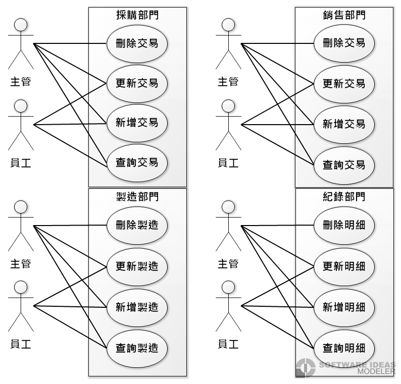
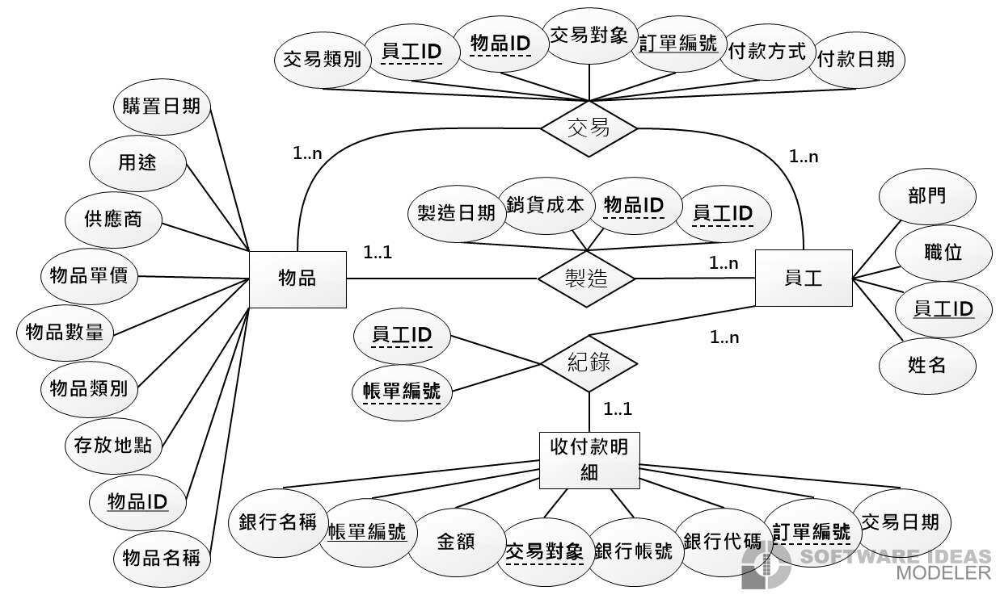
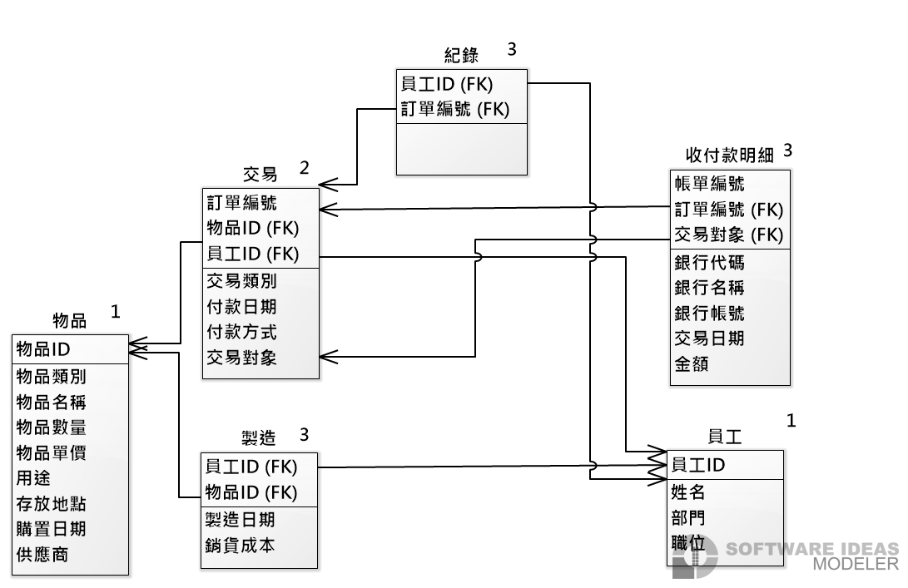

<!-- Version description:
  This version contains "Client" entity with extended relationships.
-->

# 礦業會計系統

資料庫系統期末專題

題目:礦業會計系統

指導教授:江季翰

組別:12

組員:

1. 41043118 呂昱諦
2. 41043116 吳枰樟
3. 41043136 俞漢威
4. 41043152 許書和

- [礦業會計系統](#礦業會計系統)
  - [應用情境](#應用情境)
  - [系統需求說明](#系統需求說明)
  - [使用案例](#使用案例)
    - [使用案例圖](#使用案例圖)
  - [完整性限制](#完整性限制)
  - [ER-Diagram](#er-diagram)
    - [實體屬性與關聯說明](#實體屬性與關聯說明)
  - [詳細說明](#詳細說明)
  - [資料舉例](#資料舉例)
  - [Schema](#schema)
  - [SQL](#sql)
    - [資料表結果圖](#資料表結果圖)
  - [分工](#分工)
  - [參考資料](#參考資料)

## 應用情境

作為礦業開發公司所使用的會計系統,
本系統資料庫涵蓋材料、存貨、訂單、物品之儲存,
可延伸之應用為訂單、存貨、貿易、會計、管理系統等。

礦業進行開發時，可記錄採集到之天然礦物，與員工生產之商品。
而礦業開發所運用到之各項器具、物品等，將儲存至資料庫中。
會計系統將以存貨、銷售、與進貨產生的付款收款明細來結算交易。

## 系統需求說明
<!-- TODO: 修改需求說明，因交易類別已移除 
依據新編之完整性限制中，新增之實體與關聯，修改此段。
-->
本系統將存貨、材料、工具或裝置等以物品ID、物品類別、名稱、數量、
數量單位、單價、用途、存放地點、購置日期與供應商等，儲存至物品資料表。
其中，存貨無需紀錄供應商、購置日期。

員工資料表儲存員工ID、員工姓名、所屬部門與其職位，
其中員工部門與職位應依據事實填寫。

銀行資料表儲存合法的銀行代號與銀行名稱，用於確認錯誤的代碼。

客戶資料表儲存客戶ID與其名稱。首次消費之顧客應新增至此。

供應商資料表儲存供應商ID與其名稱，只儲存與本公司合作之企業。

物品類別資料表儲存各類別ID與其說明。

倉庫資料表紀錄各倉庫ID與其地址，可依照需求填寫該倉庫備註。

採購部門進貨時，供應訂單應紀錄負責員工ID、物品ID、物品數量、供應商、訂單編號、付款方式與付款日期。
銷售部門賣出存貨時，應紀錄之項目如採購部門相同。

生產部門儲存商品時,應紀錄負責員工ID、物品ID、銷貨成本與製造日期，此處物品單價意指商品售價。

會計系統將收付款明細結算交易時,應紀錄專責員工ID與帳單編號。
收付款明細將紀錄帳單編號、訂單編號、交易日期、銀行代號、銀行帳號、銀行名稱、交易對象與金額。

## 使用案例

### 使用案例圖



## 完整性限制

實體

1. 員工
   1. 員工ID:長度為11的大寫英數字串,不可為空,格式為 `DEP-POS-ID`
      1. 三個部分以 `-` 符號分隔,字母皆為大寫。
      2. `DEP` 代表部門,以1至3位大寫英文字母編碼。
      3. `POS` 代表職位,以1至3位大寫英文字母編碼。
      4. `ID` 為3位大寫英文字母與數字編碼。
      5. 縮寫舉例列於 [詳細說明](#詳細說明)
   2. 部門:長度為10的中文字串,須符合公司內的部門名稱,不可為空。
   3. 職位:長度為10的中文字串,須符合公司內的職位名稱,不可為空。
   4. 姓名:長度為10的中文字串,須符合姓氏+名字順序,不可為空。

2. 銀行
   1. 銀行代碼:長度為的數字串,不可為空。
      1. 格式為 `金融機構總代號` `分支機構代號`,皆可由`0`開頭。
      2. `金融機構總代號` 為3碼數字
      3. `分支機構代號` 為4碼數字
      4. `金融機構總代號` 可單獨存在，`分支機構代號`必須接在其後。
      5. `金融機構總代號` 與 `分支機構代號` 同時存在時，中間不須連接符號
      6. 驗證是否為合法來源: [財金資訊股份有限公司 總分支機構查詢](https://www.fisc.com.tw/TC/Service?CAID=51254999-5d15-4ddf-8e54-4b2cdb2a8399)
   2. 銀行名稱:長度為30的中文字串，不可為空。
      1. 需為中華民國登記在案的銀行名稱。
      2. 參考來源: [財金資訊股份有限公司 總分支機構查詢](https://www.fisc.com.tw/TC/Service?CAID=51254999-5d15-4ddf-8e54-4b2cdb2a8399)

3. 客戶
   1. 客戶ID:長度為10的大寫英數字串, 格式為 `Client-ID`, 不可為空。
      1. `Client` 為6個字元之大寫字母 `CLIENT`
      2. 第八個字元為 `-`
      3. `ID` 為長度三且隨機的大寫英數字串, `[A-Z0-9]{3}`
   2. 客戶名稱:長度為30的中文字串, 不可為空

4. 供應商
   1. 供應商ID:長度為6的大寫英數字串, 格式為 `Supplier-ID`, 不可為空
      1. `Supplier` 為三個大寫字母`SUP`
      2. 第四個字元為 `-`
      3. `ID` 為長度二且隨機的大寫英數字串, `[A-Z0-9]{2}`
   2. 供應商名稱:長度為50的中文字串, 不可為空
      1. 需符合登記在經濟部公司法人名稱

5. 物品類別
   1. 物品類別ID:長度為7的大寫英數字串，格式為 `CAT-No`, 不可為空
      1. 兩個部分 `CAT` 與 `itmeID` 之間以 `-` 字元分隔
      2. `CAT` 為固定的三個大寫字母：CAT
      3. `No` 為隨機三位整數。
   2. 類別說明, 不可為空
      1. 長度為10的中文字串,如礦石類、工具類、材料類,預設值為未分類。

6. 倉庫
   1. 倉庫ID:長度為7的大寫英數字串，格式為 `WH-ID`,不可為空。
      1. 前2個字元固定為 `WH`
      2. 第3個字元為 `-` 作為分隔符號
      3. `ID`為四個數字字元，`0000`至 `9999`
   2. 倉庫地址:不超過70字元字串，格式為 `縣市-鄉鎮市區-村里-道路街名-巷-弄-號-樓-室`，不可為空。
   3. 倉庫備註:不超過100字元字串，可為空。

7. 物品
   1. 物品ID:長度為15的大寫英數字串, 不可為空
      1. `[A-Z]{5}[0-9]{10}`
      2. 無連接符號
      3. 前五碼為大寫英文AAAAA~ZZZZZ
      4. 後十碼為正整數0000000000~9999999999。
   2. 物品類別ID:長度為7的字串，格式為 `CAT-No`, 參考 `物品類別實體之類別ID`
   3. 物品名稱:長度為50的字串,不可為空。
   4. 物品數量:正浮點數,不可為空,預設值為0.0。
      1. 若物品類別無法以個數計數時，單位為公斤
      2. 物品數量單位不另外分類與紀錄
   5. 數量單位:四個字元的字串，只可為以下字串。不可為空。
      1. "公斤"、"公尺"、"立方公尺"、"平方公尺"、"個"、"單位"。
      2. 對應物品類別選擇適當的單位。
   6. 物品單價:正整數,不可為空,預設值為0。
   7. 用途:長度為50的字串,可為空,預設值為NULL。
   8. 存放地點:長度為7的字串，參考`倉庫實體之倉庫ID`,不可為空。
   9. 購置日期:只儲存年月日,不得小於公司建立日期,預設值為NULL。
      1. 格式為 `yyyy/MM/dd`
   10. 供應商:長度為6的字串, 參考`供應商實體之供應商ID`。

8. 訂單
   1. 訂單編號:長度為12的字串,格式為 `DATE-OrderId`。
      1. `DATE` 為下單日期, 長度為8的數字字串, 格式為 `YYYYMMDD`, 紀錄年月日
      2. 第9碼為字元 `-`
      3. `OrderId` 為3碼隨機, 包含大小寫的英文字母及數字
   2. 付款日期:儲存日期時間,不得小於從公司建立日期, 可為空,預設值為NULL。
      1. 格式為 `yyyy/MM/dd`
   3. 付款方式:長度為2的中文字串，只可為 "匯款"或"付現"，不可為空。
   4. 交易對象:長度為10的字串, 參考 `客戶實體之客戶ID`, 不可為空。

9. 訂單明細
   1. 明細ID:長度為15的字串,格式為 `DATE-OrderId-Detail`。
      1. 三個部分以 `-` 字元分隔
      2. `DATE` 為下單日期, 長度為8的數字字串, 格式為 `YYYYMMDD`, 紀錄年月日
      3. `OrderId` 為3碼隨機, 包含大小寫的英文字母及數字
      4. `Detail` 為2碼正整數，範圍由 00至99
   2. 訂單編號:長度為12的字串,格式為 `DATE-OrderId`。
      1. `DATE` 為下單日期, 長度為8的數字字串, 格式為 `YYYYMMDD`, 紀錄年月日
      2. 第9碼為字元 `-`
      3. `OrderId` 為3碼隨機, 包含大小寫的英文字母及數字
   3. 交易商品:長度為15的大寫英數字串，參考 `物品實體之物品ID`
   4. 交易數量:正浮點數，不可為空。
      1. 對應`物品類別`，若為可數之物品，小數點後應為零。
   5. 數量單位:四個字元的字串，只可為以下字串。不可為空。
      1. "公斤"、"公尺"、"立方公尺"、"平方公尺"、"個"、"單位"。
      2. 對應物品類別選擇適當的單位。

10. 收付款明細
    1. 帳單編號:長度為10的字母與數字,不可為空。格式如下。
       1. `^[A-Za-z0-9]{3}-[0-9]{6}$`
       2. 前3碼為隨機的英文字母及數字
       3. 第4碼為字元"-"
       4. 後6碼為隨機的數字
    2. 訂單編號:長度為12的字串,參考`訂單實體之訂單編號`,格式為 `DATE-OrderId`。
       1. `DATE` 為下單日期, 長度為8的數字字串, 格式為 `YYYYMMDD`, 紀錄年月日
       2. 第9碼為字元 `-`
       3. `OrderId` 為3碼隨機, 包含大小寫的英文字母及數字
    3. 交易對象:長度為10的字串, 參考 `客戶實體之客戶ID`, 不可為空
    4. 銀行代號:長度為3的字串, 參考 `銀行實體之銀行代號`。
       1. 若該筆訂單非轉匯款支付，不可為空。
    5. 銀行帳號:長度為14的數字字串,7+7(局號+帳號)。
       1. 若該筆訂單非轉匯款支付，不可為空。
    6. 交易日期:只儲存年月日,不得小於從公司建立日期,預設值為NULL。
       1. 格式為 `yyyy/MM/dd`
    7. 金額:正整數,不可為空

關聯

1. 訂單處理關係
   <!-- 員工處裡訂單 -->
   1. 訂單編號:長度為12的字串，格式為 `DATE-OrderId`，參考`訂單實體之訂單編號`。
      1. `DATE` 為下單日期, 長度為8的數字字串, 格式為 `YYYYMMDD`, 紀錄年月日
      2. 第9碼為字元 `-`
      3. `OrderId` 為3碼隨機, 包含大小寫的英文字母及數字
   2. 員工ID:長度為10的字串,不可為空,格式為`DEP-POS-ID`，參考`員工實體之員工ID`

2. 出貨關係
   <!-- 物品提供給訂單 -->
   1. 物品ID:長度為15的大寫英數字串, 不可為空
      1. `[A-Z]{5}[0-9]{10}`
      2. 前五碼為大寫英文AAAAA~ZZZZZ
      3. 後十碼為正整數0000000000~9999999999。
   2. 訂單編號:長度為12的字串，格式為 `DATE-OrderId`，參考`訂單實體之訂單編號`。

3. 下單關係
   <!-- 客戶下定訂單 -->
   1. 客戶ID:長度為10的大寫英數字串，格式為 `Client-ID`，參考`客戶實體之客戶ID`。
   2. 訂單編號:長度為12的字串，格式為 `DATE-OrderId`，參考`訂單實體之訂單編號`。

4. 製造關係
   1. 員工ID:長度為10的字串,不可為空,格式為`DEP-POS-ID`。
   2. 物品ID:長度為15的字串,格式如前述。
   3. 製造數量:正浮點數，商品可能為不可數物品。
   4. 製造日期:儲存日期時間,可為空,不得小於從公司建立日期,預設值為輸入資料當日。
      1. 格式為 `yyyy/MM/dd`
   5. 銷貨成本:正整數,包含零,預設值為NULL。

5. 紀錄關係
   1. 員工ID:長度為10的字串,不可為空,格式為`DEP-POS-ID`。
   2. 帳單編號:長度為10的字母與數字，參考`收付款明細實體之帳單編號`。
      1. 格式為 `^[A-Za-z0-9]{3}-\d{6}$`

6. 供應關係
   <!-- 採購部向供應商進貨 -->
   1. 供應商ID:長度為6的大寫英數字串，參考`供應商實體之供應商ID`。
   2. 訂單編號:長度為12的字串，格式為 `DATE-OrderId`，參考`訂單實體之訂單編號`。

7. 包含關係
   <!-- 物品屬於對應類別 -->
   1. 物品ID:長度為15的字串，參考`物品實體之物品ID`。
   2. 類別ID:長度為7的字串，格式為 `CAT-No`, 參考 `物品類別ID`

8. 存放關係
   <!-- 物品存放在指定的倉庫 -->
   1. 倉庫ID:長度為7的字串，參考`倉庫實體之倉庫ID`。
   2. 物品ID:長度為15的字串，參考`物品實體之物品ID`。

9. 確認關係
   1. 帳單編號:長度為10的字母與數字，參考`收付款明細實體之帳單編號`。
   2. 銀行代號:長度為3的字串, 參考 `銀行實體之銀行代號`。

10. 產生關係
    1. 訂單編號:長度為12的字串，格式為 `DATE-OrderId`，參考`訂單實體之訂單編號`。
    2. 明細ID:長度為15的字串,格式為 `DATE-OrderId-Detail`，參考`訂單明細實體之明細ID`。

## ER-Diagram

共有十個實體

1. 物品
2. 員工
3. 收付款明細
4. 銀行
5. 客戶
6. 供應商
7. 物品類別
8. 倉庫
9. 訂單
10. 訂單明細

共有十個關聯

1. 處理訂單
2. 製造
3. 紀錄
4. 下單
5. 供應
6. 出貨
7. 包含
8. 存放
9. 確認
10. 產生



### 實體屬性與關聯說明

此段僅列出實體所擁有之屬性，
說明列於[詳細說明](#詳細說明)

實體

| 實體 | 屬性   | Key         |
| ---- | ------ | ----------- |
| 員工 | 員工ID | Primary Key |
|      | 姓名   |             |
|      | 部門   |             |
|      | 職位   |             |

| 實體 | 屬性     | Key           |
| ---- | -------- | ------------- |
| 銀行 | 銀行代號 | Primary Key   |
|      | 銀行名稱 | Alternate Key |

| 實體 | 屬性     | Key         |
| ---- | -------- | ----------- |
| 客戶 | 客戶ID   | Primary Key |
|      | 客戶名稱 |             |

| 實體   | 屬性       | Key           |
| ------ | ---------- | ------------- |
| 供應商 | 供應商ID   | Primary Key   |
|        | 供應商名稱 | Alternate Key |

| 實體     | 屬性       | Key         |
| -------- | ---------- | ----------- |
| 物品類別 | 物品類別ID | Primary Key |
|          | 類別說明   |             |

| 實體 | 屬性     | Key           |
| ---- | -------- | ------------- |
| 倉庫 | 倉庫ID   | Primary Key   |
|      | 倉庫地址 | Alternate Key |
|      | 倉庫備註 |               |

| 實體 | 屬性       | Key           |
| ---- | ---------- | ------------- |
| 物品 | 物品ID     | Primary Key   |
|      | 物品類別ID | Foreign Key   |
|      | 物品名稱   | Alternate Key |
|      | 物品數量   |               |
|      | 數量單位   |               |
|      | 物品單價   |               |
|      | 用途       |               |
|      | 存放地點   | Foreign Key   |
|      | 購置日期   |               |
|      | 供應商     | Foreign Key   |

| 實體 | 屬性     | Key         |
| ---- | -------- | ----------- |
| 訂單 | 訂單編號 | Primary Key |
|      | 付款日期 |             |
|      | 付款方式 |             |
|      | 交易對象 | Foreign Key |

| 實體     | 屬性     | Key         |
| -------- | -------- | ----------- |
| 訂單明細 | 明細ID   | Primary Key |
|          | 訂單編號 | Foreign Key |
|          | 物品ID   | Foreign Key |
|          | 購買數量 |             |
|          | 數量單位 |             |

| 實體       | 屬性     | Key           |
| ---------- | -------- | ------------- |
| 收付款明細 | 帳單編號 | Primary Key   |
|            | 訂單編號 | Foreign Key   |
|            | 交易對象 | Foreign Key   |
|            | 銀行代號 | Foreign Key   |
|            | 銀行帳號 | Alternate Key |
|            | 交易日期 |               |
|            | 金額     |               |

關聯

1. 訂單處理關係
   | 關聯     | 關聯實體 | 關聯實體 | Cardinality | 說明                                                     |
   | -------- | -------- | -------- | ----------- | -------------------------------------------------------- |
   | 訂單處理 | 訂單     | 員工     | 多對一      | 多筆訂單可以被同一個員工處理，每筆訂單只能由一個員工處理 |

   員工 -> 訂單: 1..n

   訂單 -> 員工: 1..1

   | 關聯     | 屬性     | Key         |
   | -------- | -------- | ----------- |
   | 訂單處理 | 訂單編號 | Foreign Key |
   |          | 員工ID   | Foreign Key |

2. 出貨關係
   | 關聯 | 關聯實體 | 關聯實體 | Cardinality | 說明                                                     |
   | ---- | -------- | -------- | ----------- | -------------------------------------------------------- |
   | 出貨 | 訂單明細 | 物品     | 多對一      | 多筆訂單明細可以出貨同一個物品，每筆訂單明細只有一個物品 |

   物品 -> 訂單明細: 1..n

   訂單明細 -> 物品: 1..1

   | 關聯 | 屬性   | Key         |
   | ---- | ------ | ----------- |
   | 出貨 | 物品ID | Foreign Key |
   |      | 明細ID | Foreign Key |

3. 下單關係
   | 關聯 | 關聯實體 | 關聯實體 | Cardinality | 說明                                                     |
   | ---- | -------- | -------- | ----------- | -------------------------------------------------------- |
   | 下單 | 訂單     | 客戶     | 多對一      | 一個客戶可以送出多筆訂單，且每個訂單都只對應到一個客戶 |

   客戶 -> 訂單: 1..n

   訂單 -> 客戶: 1..1

   | 關聯 | 屬性     | Key         |
   | ---- | -------- | ----------- |
   | 下單 | 客戶ID   | Foreign Key |
   |      | 訂單編號 | Foreign Key |

4. 產生關係
   | 關聯 | 關聯實體 | 關聯實體 | Cardinality | 說明                                                     |
   | ---- | -------- | -------- | ----------- | -------------------------------------------------------- |
   | 產生 | 訂單明細 | 訂單     | 多對一      | 一筆訂單可以產生多張訂單明細，每張明細只會對應到一筆訂單 |

   訂單 -> 訂單明細: 1..n

   訂單明細 -> 訂單: 1..1

   | 關聯 | 屬性       | Key         |
   | ---- | ---------- | ----------- |
   | 產生 | 訂單明細ID | Foreign Key |
   |      | 訂單編號   | Foreign Key |

5. 製造關係
   | 關聯 | 關聯實體 | 關聯實體 | Cardinality | 說明                                                       |
   | ---- | -------- | -------- | ----------- | ---------------------------------------------------------- |
   | 製造 | 物品     | 員工     | 多對多      | 一個員工會可以負責製造多個商品，且一個商品可由多位員工負責 |

   物品 -> 員工: 1..n

   員工 -> 物品: 1..1

   | 關聯 | 屬性     | Key         |
   | ---- | -------- | ----------- |
   | 製造 | 員工ID   | Foreign Key |
   |      | 物品ID   | Foreign Key |
   |      | 製造數量 |             |
   |      | 銷貨成本 |             |
   |      | 製造日期 |             |

6. 紀錄關係
   | 關聯 | 關聯實體 | 關聯實體   | Cardinality | 說明                                                                 |
   | ---- | -------- | ---------- | ----------- | -------------------------------------------------------------------- |
   | 紀錄 | 員工     | 收付款明細 | 多對一      | 一個員工會可以負責紀錄多筆收付款明細，且一個明細只會由一位員工負責。 |

   員工 -> 收付款明細: 1..n

   收付款明細 -> 員工: 1..1

   | 關聯 | 屬性     | Key         |
   | ---- | -------- | ----------- |
   | 紀錄 | 員工ID   | Foreign Key |
   |      | 帳單編號 | Foreign Key |

7. 供應關係
   | 關聯 | 關聯實體 | 關聯實體 | Cardinality | 說明                                                         |
   | ---- | -------- | -------- | ----------- | ------------------------------------------------------------ |
   | 供應 | 訂單   | 供應商     | 多對一      | 一間供應商可以供應多筆訂單，且每個訂單都只對應到一間供應商。 |

   訂單 -> 供應商: 1..n

   供應商 -> 訂單: 1..1

   | 關聯 | 屬性     | Key         |
   | ---- | -------- | ----------- |
   | 供應 | 供應商ID | Foreign Key |
   |      | 訂單編號 | Foreign Key |

8. 包含關係
   | 關聯 | 關聯實體 | 關聯實體 | Cardinality | 說明                                                         |
   | ---- | -------- | -------- | ----------- | ------------------------------------------------------------ |
   | 包含 | 物品類別 | 物品     | 多對一      | 一個物品類別可以包含多種物品，且一種物品只屬於一項物品類別。 |

   物品 -> 物品類別: 1..n

   物品類別 -> 物品: 1..1

   | 關聯 | 屬性   | Key         |
   | ---- | ------ | ----------- |
   | 包含 | 物品ID | Foreign Key |
   |      | 類別ID | Foreign Key |

9. 存放關係
   | 關聯 | 關聯實體 | 關聯實體 | Cardinality | 說明                                                     |
   | ---- | -------- | -------- | ----------- | -------------------------------------------------------- |
   | 存放 | 物品     | 倉庫     | 多對一      | 多種物品可以存放到一個倉庫，每種物品只存放在一個倉庫中。 |

   物品 -> 倉庫: 1..n

   倉庫 -> 物品: 1..1

   | 關聯 | 屬性   | Key         |
   | ---- | ------ | ----------- |
   | 存放 | 倉庫ID | Foreign Key |
   |      | 物品ID | Foreign Key |

10. 確認關係
   | 關聯 | 關聯實體   | 關聯實體 | Cardinality | 說明                                                         |
   | ---- | ---------- | -------- | ----------- | ------------------------------------------------------------ |
   | 確認 | 收付款明細 | 銀行     | 多對一      | 多筆明細可對照到一間銀行，但每筆收付款明細只對應到一家銀行。 |

   銀行 -> 收付款明細: 1..n

   收付款明細 -> 銀行: 1..1

   | 關聯 | 屬性     | Key         |
   | ---- | -------- | ----------- |
   | 確認 | 帳單編號 | Foreign Key |
   |      | 銀行代號 | Foreign Key |

## 詳細說明

實體

| 實體 | 屬性   | Key         | Domain                                | 說明                                                   |
| ---- | ------ | ----------- | ------------------------------------- | ------------------------------------------------------ |
| 員工 | 員工ID | Primary Key | 格式為 `DEP-POS-ID`                   | 員工的ID，`DEP` 代表部門、`POS` 代表職位、`ID`為編號。 |
|      |        |             | `^[A-Z]{1,3}-[A-Z]{1,3}-[A-Z0-9]{3}$` | 部門、職位依據員工實際資料，編號由程式產生。           |
|      |        |             |                                       | `ID` 能為各部門的不同職位提供 46656 個員工ID。         |
|      | 姓名   |             | 長度為10的中文字串                    | 員工的姓名。                                           |
|      | 部門   |             | 長度為10的中文字串                    | 員工部門，該部門需存在於公司中。                       |
|      | 職位   |             | 長度為10的中文字串                    | 員工職位，該職位需存在於公司中。                       |

員工ID範例: POD-BL-A00

部門縮寫範例

1. `MSD`: Marketing and Sales Department, 行銷與銷售部門
2. `FD`: Finance Department, 財務部門
3. `POD`: Production/Operations Department, 生產/運營部門
4. `RDD`: Research and Development Department, 研究與開發部門
5. `CSD`: Customer Service Department, 客戶服務部門
6. `PD`: Purchasing Department, 採購部門
7. `ITD`: IT Department, 資訊科技部門

職位縮寫範例

1. `BL`: Blaster, 爆破工
2. `UM`: Underground Miner, 地下礦工
3. `HEO`: Heavy Equipment Operator, 重型設備操作員
4. `DR`: Driller, 鑽孔員
5. `EL`: Electrician, 電工
6. `MP`: Material Planner, 物料規劃員
7. `HSS`: Health and Safety Specialist, 健康與安全專員
8. `MM`: Mine Manager, 礦場經理
9. `CH`: Chemist, 化學家
10. `GE`: Geological Engineer, 地質工程師

| 實體 | 屬性     | Domain                                 | 說明                                                                                     |
| ---- | -------- | -------------------------------------- | ---------------------------------------------------------------------------------------- |
| 銀行 | 銀行代號 | 格式為 `金融機構總代號` `分支機構代號` | 客戶付款的銀行帳號代碼                                                                   |
|      |          | `^([0-9]{3}\|[0-9]{7})$`               | 通常只需`銀行代號`(金融機構總代號)，在填入`分支代號`(分支機構代號)時，需確認是否有總代號 |
|      |          |                                        | 最後將與銀行列表確認是否為合法代碼，若不存在則為錯誤代號。                               |
|      |          |                                        | 已蒐集之包含分支機構銀行列表總數，為5292間                                               |
|      | 銀行名稱 | 長度為30的中文字串                     | 由`金融機構總代號`或其`分支機構代號`對應之機構名稱，用於說明銀行代號                     |

004可單獨輸入，代表臺灣銀行，0040093為臺灣銀行臺南分行。
0093不可單獨使用，且銀行分部代號不唯一。

| 實體 | 屬性     | Domain                 | 說明                                               |
| ---- | -------- | ---------------------- | -------------------------------------------------- |
| 客戶 | 客戶ID   | 格式為 `Client-ID`     | 每位新客戶將由程式產生隨機`ID`並儲存至`客戶`資料表 |
|      |          | `^CLIENT-[A-Z0-9]{3}$` | 此格式可記錄46656位客戶                            |
|      | 客戶名稱 | 長度為30的中文字串     | 考慮可能為個人與法人(公司)而設定此長度             |

客戶ID範例: CLIENT-A00

| 實體   | 屬性       | Domain               | 說明                               |
| ------ | ---------- | -------------------- | ---------------------------------- |
| 供應商 | 供應商ID   | 格式為 `Supplier-ID` | 新合作的供應商，其ID由程式隨機產生 |
|        |            | `^SUP-[A-Z0-9]{2}$`  | 此編號可記錄1296個合作供應商       |
|        | 供應商名稱 | 長度為50的中文字串   | 需符合登記在經濟部公司法人名稱     |

供應商ID範例: SUP-A0

| 實體     | 屬性       | Domain             | 說明                               |
| -------- | ---------- | ------------------ | ---------------------------------- |
| 物品類別 | 物品類別ID | 格式為 `CAT-No`    | 由程式為各類物品類別分配隨機ID     |
|          |            | `^CAT-[0-9]{3}$`   | 此格式可記錄1000種類別             |
|          | 類別說明   | 長度為10的中文字串 | 類別ID的說明欄為，說明該代號的類別 |

物品類別ID範例: CAT-000

類別說明範例

1. 礦石類
2. 工具類
3. 材料類
4. 未分類

| 實體 | 屬性     | Domain                                              | 說明                         |
| ---- | -------- | --------------------------------------------------- | ---------------------------- |
| 倉庫 | 倉庫ID   | 格式為 `WH-ID`                                      | 每間倉庫由程式隨機分配ID     |
|      |          | `^WH-[0-9]{4}$`                                     | 此格式可記錄10000個倉庫       |
|      | 倉庫地址 | 格式為 `縣市-鄉鎮市區-村里-道路街名-巷-弄-號-樓-室` | 倉庫實際地址，按照其格式填寫 |
|      | 倉庫備註 | 不超過100字元字串                                   | 說明該倉庫的備註             |

倉庫ID範例: WH-0000

| 實體 | 屬性       | Domain                                   | 說明                                                  |
| ---- | ---------- | ---------------------------------------- | ----------------------------------------------------- |
| 物品 | 物品ID     | `[A-Z]{5}[0-9]{10}`                      | 物品的編號，由程式產生                                |
|      |            |                                          | 此格式可記錄11,881,376,000,000,000種物品              |
|      | 物品類別ID | 長度為7的字串                            | 物品對應的類別所屬之類別ID                            |
|      | 物品名稱   | 長度為50的字串                           | 物品類別，由類別判斷是否為商品，參考 `物品類別ID`     |
|      | 物品數量   | 正浮點數                                 | 使用正浮點數可應對不同單位的計數，可數物品則小數只為0 |
|      | 數量單位   | 公斤、公尺、立方公尺、平方公尺、個、單位 | 依照物品類別使用對應的單位                            |
|      | 物品單價   | 正整數                                   | 物品為商品時，指物品售價；否則為購入的物品單價        |
|      | 用途       | 長度為50的字串                           | 物品之說明欄位                                        |
|      | 存放地點   | 長度為7的字串，參考`倉庫之倉庫ID`        | 物品存放地點                                          |
|      | 購置日期   | 格式為 `yyyy/MM/dd`，不小公司建立日期    | 物品之購入日期                                        |
|      | 供應商     | 長度為6的字串, 參考`供應商之供應商ID`    | 購入物品之供應商，物品為商品時，此欄位為空            |

物品ID範例: AAAAA0000000000

| 實體 | 屬性     | Domain                                | 說明                                               |
| ---- | -------- | ------------------------------------- | -------------------------------------------------- |
| 訂單 | 訂單編號 | 格式為 `DATE-OrderId`                 | 每個訂單編號將由程式產生，由下單日為基礎產生       |
|      |          | `[0-9]{8}-[A-Za-z0-9]{3}`             | 每日可記錄238328、每年8698972筆訂單                |
|      | 付款日期 | 格式為 `yyyy/MM/dd`，不小公司建立日期 | 客戶付款日期，只記錄年月日                         |
|      | 付款方式 | "匯款"或"付現"                        | 客戶付款方式，若為付現則`收付款明細`不紀錄銀行代號 |
|      | 交易對象 | 參考 `客戶之客戶ID`                   | 下單客戶之客戶ID                                   |

訂單編號範例: 20240101-Aa0

| 實體     | 屬性     | Domain                                   | 說明                                                                       |
| -------- | -------- | ---------------------------------------- | -------------------------------------------------------------------------- |
| 訂單明細 | 明細ID   | 格式為 `DATE-OrderId-Detail`             | 每筆訂單為個別售出物品產生明細單，一筆訂單若有多項商品，則有由多張明細組成 |
|          |          | `[0-9]{8}-[A-Za-z0-9]{3}-[0-9]{2}`       | 此格式以訂單編號為基礎，為每筆訂單提供100筆明細                            |
|          | 訂單編號 | 格式為 `DATE-OrderId`                    | 參考 `訂單之訂單編號`                                                      |
|          | 交易商品 | 長度為15的大寫英數字串                   | 參考 `物品實體之物品ID`                                                    |
|          | 交易數量 | 正浮點數                                 | 使用正浮點數可應對不同單位的計數，可數物品則小數只為0                      |
|          | 數量單位 | 公斤、公尺、立方公尺、平方公尺、個、單位 | 依照物品類別使用對應的單位                                                 |

明細ID範例: 20240101-Aa0-00

| 實體       | 屬性     | Domain                            | 說明                                                                                    |
| ---------- | -------- | --------------------------------- | --------------------------------------------------------------------------------------- |
| 收付款明細 | 帳單編號 | `^[A-Za-z0-9]{3}-[0-9]{6}$`       | 紀錄收付款明細的，此編號由系統產生                                                      |
|            | 訂單編號 | 格式為 `DATE-OrderId`             | 銷售或進貨訂單上的訂單編號，此編號由系統產生，參考`訂單實體之訂單編號`                  |
|            | 銀行名稱 | 長度為30的中文字串                | 對應銀行代號之銀行名稱，參考`銀行實體之銀行名稱`                                        |
|            | 交易對象 | 長度為30的中文字串                | 交易對象為客戶時，此為銷售，對象為供應商時，則為進貨。參考 `客戶與供應商銀行實體之主鍵` |
|            | 銀行代號 | 長度為3的字串                     | 該銀行對應的三碼數字，由程式檢查其正確性，參考 `銀行實體之銀行代號`                     |
|            | 銀行帳號 | 長度為14的數字字串,7+7(局號+帳號) | 銀行的帳號                                                                              |
|            | 交易日期 | 格式為 `yyyy/MM/dd`               | 只儲存年月日，不得小於從公司建立日期                                                    |
|            | 金額     | 正整數                            | 該訂單的金額                                                                            |

帳單編號範例: Aa0-000000

關聯

1. 訂單處理關係
   | 關聯     | 關聯實體 | 關聯實體 | Cardinality | 說明                                                     |
   | -------- | -------- | -------- | ----------- | -------------------------------------------------------- |
   | 訂單處理 | 訂單     | 員工     | 多對一      | 多筆訂單可以被同一個員工處理，每筆訂單只能由一個員工處理 |

   此關聯可被合併為單一欄位至`訂單`資料表

2. 出貨關係
   | 關聯 | 關聯實體 | 關聯實體 | Cardinality | 說明                                                       |
   | ---- | -------- | -------- | ----------- | ---------------------------------------------------------- |
   | 出貨 | 物品     | 訂單明細 | 一對多      | 一個物品可以對應到多筆訂單明細，但每筆訂單明細只有一個物品 |

   此關聯可被合併為單一欄位至`訂單明細`資料表

    ```sql
    CREATE TABLE 物品 (
    物品ID INT PRIMARY KEY,
    物品名稱 VARCHAR(100),
    物品描述 TEXT
    );

   CREATE TABLE 訂單明細 (
      訂單明細ID INT PRIMARY KEY,
      物品ID INT,
      數量 INT,
      FOREIGN KEY (物品ID) REFERENCES 物品(物品ID)
    );
    ```

3. 下單關係
   | 關聯 | 關聯實體 | 關聯實體 | Cardinality | 說明                                                     |
   | ---- | -------- | -------- | ----------- | -------------------------------------------------------- |
   | 下單 | 訂單     | 客戶     | 多對一      | 一個客戶可以送出多筆訂單，且每個訂單都只對應到一個客戶 |

   此關聯可被合併為單一欄位至`訂單`資料表

    > 根據您提供的信息，訂單與客戶之間的關係是一對多（1..n 至 1..n），這意味著一個客戶可以有多筆訂單，但每筆訂單只對應到一個客戶。在這種情況下，我們不需要創建一個新的表來表示這種關係。相反，我們可以在訂單表中添加一個外鍵來參照客戶表。
    >
    >以下是用SQL表示這種關係的例子：
    >
    > ```sql
    > -- 創建客戶表
    > CREATE TABLE Customers (
    >     CustomerID INT PRIMARY KEY,
    >     CustomerName VARCHAR(255),
    >     CustomerContact VARCHAR(255)
    > );
    >
    > -- 創建訂單表，包含指向客戶表的外鍵
    > CREATE TABLE Orders (
    >     OrderID INT PRIMARY KEY,
    >     OrderDate DATE,
    >     CustomerID INT,
    >     FOREIGN KEY (CustomerID) REFERENCES Customers(CustomerID)
    > );
    > ```
    >
    > 在這個例子中，`Orders` 表中的 `CustomerID` 外鍵字段參照 `Customers` 表的主鍵，從而建立了訂單和客戶之間的一對多關係。這樣，我們就可以知道每筆訂單是由哪個客戶下的，而不需要額外創建一個表來存儲這些信息。

4. 產生關係
   | 關聯 | 關聯實體 | 關聯實體 | Cardinality | 說明                                                     |
   | ---- | -------- | -------- | ----------- | -------------------------------------------------------- |
   | 產生 | 訂單明細 | 訂單     | 多對一      | 一筆訂單可以產生多張訂單明細，每張明細只會對應到一筆訂單 |

   此關聯可被合併為單一欄位至`訂單明細`資料表

    > 根據您提供的信息，訂單與訂單明細之間的關係是一對多（1..n 至 n..1），這意味著一筆訂單可以產生多張訂單明細，但每張訂單明細只對應到一筆訂單。在這種情況下，我們不需要創建一個新的表來表示這種關係。相反，我們可以在訂單明細表中添加一個外鍵來參照訂單表。
    >
    > 以下是用SQL表示這種關係的例子：
    >
    > ```sql
    > -- 創建訂單表
    > CREATE TABLE Orders (
    >     OrderID INT PRIMARY KEY,
    >     OrderDate DATE,
    >     CustomerID INT
    >     -- 其他訂單相關欄位
    > );
    > 
    > -- 創建訂單明細表，包含指向訂單表的外鍵
    > CREATE TABLE OrderDetails (
    >     OrderDetailID INT PRIMARY KEY,
    >     OrderID INT,
    >     ProductID INT,
    >     Quantity INT,
    >     FOREIGN KEY (OrderID) REFERENCES Orders(OrderID)
    >     -- 其他訂單明細相關欄位
    > );
    > ```
    >
    > 在這個例子中，`OrderDetails` 表中的 `OrderID` 外鍵字段參照 `Orders` 表的主鍵，從而建立了訂單和訂單明細之間的一對多關係。這樣，我們就可以知道每張訂單明細是屬於哪一筆訂單的，而不需要額外創建一個表來存儲這些信息。
    >
    > 如果您有更多關於SQL或數據庫設計的問題，請隨時提問！

5. 製造關係
   | 關聯 | 關聯實體 | 關聯實體 | Cardinality | 說明                                                       |
   | ---- | -------- | -------- | ----------- | ---------------------------------------------------------- |
   | 製造 | 物品     | 員工     | 多對多      | 一個員工會可以負責製造多個商品，且一個商品可由多位員工負責 |

   | 關聯 | 屬性     | Domain                 | 說明                                 |
   | ---- | -------- | ---------------------- | ------------------------------------ |
   | 製造 | 員工ID   | 長度為10的字串         | 負責製造的員工ID                     |
   |      | 物品ID   | 長度為15的大寫英數字串 | 製造的物品                           |
   |      | 製造數量 | 正浮點數               | 製造數量，商品可能為不可數物品       |
   |      | 銷貨成本 | 正浮點數               | 製造成本，計算商品售價時將進位至整數 |
   |      | 製造日期 | 格式為 `yyyy/MM/dd`    | 製造日期，不小於公司建立日期         |

    > 根據您提供的信息，員工與物品之間的關係是多對多（1..n 至 1..n），這意味著一個員工可以負責製造多個物品，同時一個物品也可以由多位員工負責製造。在這種情況下，我們需要創建一個新的表來表示這種關係，通常稱為關聯表或連接表。
    >
    > 以下是用SQL表示這種關係的例子：
    >
    > ```sql
    > -- 創建員工表
    > CREATE TABLE Employees (
    >     EmployeeID INT PRIMARY KEY,
    >     EmployeeName VARCHAR(255)
    >     -- 其他員工相關欄位
    > );
    >
    > -- 創建物品表
    > CREATE TABLE Items (
    >     ItemID INT PRIMARY KEY,
    >     ItemName VARCHAR(255),
    >     ItemPrice DECIMAL(10, 2)
    >     -- 其他物品相關欄位
    > );
    >
    > -- 創建關聯表來表示員工和物品之間的多對多關係
    > CREATE TABLE EmployeeItems (
    >     EmployeeID INT,
    >     ItemID INT,
    >     PRIMARY KEY (EmployeeID, ItemID),
    >     FOREIGN KEY (EmployeeID) REFERENCES Employees(EmployeeID),
    >     FOREIGN KEY (ItemID) REFERENCES Items(ItemID)
    >     -- 可以添加其他描述製造關係的欄位，如製造日期等
    > );
    > ```
    >
    > 在這個例子中，`EmployeeItems` 關聯表用來存儲員工ID和物品ID之間的關係，從而表示多對多的關係。每個員工可以製造多個物品，每個物品也可以由多位員工製造。
    >
    > 如果您有更多關於SQL或數據庫設計的問題，請隨時提問！

6. 紀錄關係
   | 關聯 | 關聯實體 | 關聯實體   | Cardinality | 說明                                                                 |
   | ---- | -------- | ---------- | ----------- | -------------------------------------------------------------------- |
   | 紀錄 | 員工     | 收付款明細 | 多對一      | 一個員工會可以負責紀錄多筆收付款明細，且一個明細只會由一位員工負責。 |

   此關聯可被合併為單一欄位至`收付款明細`資料表

    > 根據您提供的信息，員工與收付款明細之間的關係是一對多（1..n 至 1..1），這意味著一個員工可以負責紀錄多筆收付款明細，但每筆收付款明細只會由一位員工負責。在這種情況下，我們不需要創建一個新的表來表示這種關係。相反，我們可以在收付款明細表中添加一個外鍵來參照員工表。
    >
    > 以下是用SQL表示這種關係的例子：
    >
    > ```sql
    > -- 創建員工表
    > CREATE TABLE Employees (
    >     EmployeeID INT PRIMARY KEY,
    >     EmployeeName VARCHAR(255)
    >     -- 其他員工相關欄位
    > );
    >
    > -- 創建收付款明細表，包含指向員工表的外鍵
    > CREATE TABLE PaymentDetails (
    >     PaymentDetailID INT PRIMARY KEY,
    >     EmployeeID INT,
    >     PaymentAmount DECIMAL(10, 2),
    >     PaymentDate DATE,
    >     FOREIGN KEY (EmployeeID) REFERENCES Employees(EmployeeID)
    >     -- 其他收付款明細相關欄位
    > );
    > ```
    >
    > 在這個例子中，`PaymentDetails` 表中的 `EmployeeID` 外鍵字段參照 `Employees` 表的主鍵，從而建立了員工和收付款明細之間的一對多關係。這樣，我們就可以知道每筆收付款明細是由哪位員工負責的，而不需要額外創建一個表來存儲這些信息。
    >
    > 如果您有更多關於SQL或數據庫設計的問題，請隨時提問！

7. 供應關係
   | 關聯 | 關聯實體 | 關聯實體 | Cardinality | 說明                                                         |
   | ---- | -------- | -------- | ----------- | ------------------------------------------------------------ |
   | 供應 | 訂單   | 供應商     | 多對一      | 一間供應商可以供應多筆訂單，且每個訂單都只對應到一間供應商。 |

   此關聯可被合併為單一欄位至`訂單`資料表

    > 根據您提供的信息，訂單與供應商之間的關係是多對一（1..n 至 1..1），這意味著一間供應商可以供應多筆訂單，但每個訂單都只對應到一間供應商。在這種情況下，我們不需要創建一個新的表來表示這種關係。相反，我們可以在訂單表中添加一個外鍵來參照供應商表。
    >
    > 以下是用SQL表示這種關係的例子：
    >
    > ```sql
    > -- 創建供應商表
    > CREATE TABLE Suppliers (
    >     SupplierID INT PRIMARY KEY,
    >     SupplierName VARCHAR(255)
    >     -- 其他供應商相關欄位
    > );
    >
    > -- 創建訂單表，包含指向供應商表的外鍵
    > CREATE TABLE Orders (
    >     OrderID INT PRIMARY KEY,
    >     OrderDate DATE,
    >     SupplierID INT,
    >     FOREIGN KEY (SupplierID) REFERENCES Suppliers(SupplierID)
    >     -- 其他訂單相關欄位
    > );
    > ```
    >
    > 在這個例子中，`Orders` 表中的 `SupplierID` 外鍵字段參照 `Suppliers` 表的主鍵，從而建立了訂單和供應商之間的多對一關係。這樣，我們就可以知道每個訂單是由哪間供應商供應的，而不需要額外創建一個表來存儲這些信息。
    >
    > 如果您有更多關於SQL或數據庫設計的問題，請隨時提問！

8. 包含關係
   | 關聯 | 關聯實體 | 關聯實體 | Cardinality | 說明                                                         |
   | ---- | -------- | -------- | ----------- | ------------------------------------------------------------ |
   | 包含 | 物品類別 | 物品     | 多對一      | 一個物品類別可以包含多種物品，且一種物品只屬於一項物品類別。 |

   此關聯可被合併為單一欄位至`物品`資料表

   | 關聯 | 屬性   | Domain | 說明 |
   | ---- | ------ | ------ | ---- |
   | 包含 | 物品ID |        |      |
   |      | 類別ID |        |      |

    > 根據您提供的信息，物品類別與物品之間的關係是多對一（1..n 至 1..1），這意味著一個物品類別可以包含多種物品，但每種物品只屬於一項物品類別。在這種情況下，我們不需要創建一個新的表來表示這種關係。相反，我們可以在物品表中添加一個外鍵來參照物品類別表。
    >
    > 以下是用SQL表示這種關係的例子：
    >
    > ```sql
    > -- 創建物品類別表
    > CREATE TABLE ItemCategories (
    >     CategoryID INT PRIMARY KEY,
    >     CategoryName VARCHAR(255)
    >     -- 其他物品類別相關欄位
    > );
    >
    > -- 創建物品表，包含指向物品類別表的外鍵
    > CREATE TABLE Items (
    >     ItemID INT PRIMARY KEY,
    >     ItemName VARCHAR(255),
    >     CategoryID INT,
    >     FOREIGN KEY (CategoryID) REFERENCES ItemCategories(CategoryID)
    >     -- 其他物品相關欄位
    > );
    > ```
    >
    > 在這個例子中，`Items` 表中的 `CategoryID` 外鍵字段參照 `ItemCategories` 表的主鍵，從而建立了物品和物品類別之間的多對一關係。這樣，我們就可以知道每種物品屬於哪一個物品類別，而不需要額外創建一個表來存儲這些信息。
    >
    > 如果您有更多關於SQL或數據庫設計的問題，請隨時提問！

9. 存放關係
   | 關聯 | 關聯實體 | 關聯實體 | Cardinality | 說明                                                     |
   | ---- | -------- | -------- | ----------- | -------------------------------------------------------- |
   | 存放 | 物品     | 倉庫     | 多對一      | 多種物品可以存放到一個倉庫，每種物品只存放在一個倉庫中。 |

   此關聯可被合併為單一欄位至`訂單明細`資料表

   | 關聯 | 屬性   | Domain | 說明 |
   | ---- | ------ | ------ | ---- |
   | 存放 | 倉庫ID |        |      |
   |      | 物品ID |        |      |

    > 根據您提供的信息，倉庫與物品之間的關係是多對一（1..n 至 1..1），這意味著多種物品可以存放到一個倉庫中，但每種物品只存放在一個倉庫中。在這種情況下，我們不需要創建一個新的表來表示這種關係。相反，我們可以在物品表中添加一個外鍵來參照倉庫表。
    >
    > 以下是用SQL表示這種關係的例子：
    >
    > ```sql
    > -- 創建倉庫表
    > CREATE TABLE Warehouses (
    >     WarehouseID INT PRIMARY KEY,
    >     WarehouseName VARCHAR(255)
    >     -- 其他倉庫相關欄位
    > );
    >
    > -- 創建物品表，包含指向倉庫表的外鍵
    > CREATE TABLE Items (
    >     ItemID INT PRIMARY KEY,
    >     ItemName VARCHAR(255),
    >     WarehouseID INT,
    >     FOREIGN KEY (WarehouseID) REFERENCES Warehouses(WarehouseID)
    >     -- 其他物品相關欄位
    > );
    > ```
    >
    > 在這個例子中，`Items` 表中的 `WarehouseID` 外鍵字段參照 `Warehouses` 表的主鍵，從而建立了物品和倉庫之間的多對一關係。這樣，我們就可以知道每種物品存放在哪個倉庫中，而不需要額外創建一個表來存儲這些信息。
    >
    > 如果您有更多關於SQL或數據庫設計的問題，請隨時提問！

10. 確認關係
    | 關聯 | 關聯實體   | 關聯實體 | Cardinality | 說明                                                         |
    | ---- | ---------- | -------- | ----------- | ------------------------------------------------------------ |
    | 確認 | 收付款明細 | 銀行     | 多對一      | 多筆明細可對照到一間銀行，但每筆收付款明細只對應到一家銀行。 |

    此關聯可被合併為單一欄位至`收付款明細`資料表

    | 關聯 | 屬性     | Domain | 說明 |
    | ---- | -------- | ------ | ---- |
    | 確認 | 帳單編號 |        |      |
    |      | 銀行代號 |        |      |

  > 根據您提供的信息，收付款明細與銀行之間的關係是多對一（1..n 至 1..1），這意味著多筆收付款明細可以對應到一家銀行，但每筆收付款明細只對應到一家銀行。在這種情況下，我們不需要創建一個新的表來表示這種關係。相反，我們可以在收付款明細表中添加一個外鍵來參照銀行表。
  >
  > 以下是用SQL表示這種關係的例子：
  >
  > ```sql
  > -- 創建銀行表
  > CREATE TABLE Banks (
  >     BankID INT PRIMARY KEY,
  >     BankName VARCHAR(255)
  >     -- 其他銀行相關欄位
  > );
  >
  > -- 創建收付款明細表，包含指向銀行表的外鍵
  > CREATE TABLE PaymentDetails (
  >     PaymentDetailID INT PRIMARY KEY,
  >     BankID INT,
  >     PaymentAmount DECIMAL(10, 2),
  >     PaymentDate DATE,
  >     FOREIGN KEY (BankID) REFERENCES Banks(BankID)
  >     -- 其他收付款明細相關欄位
  > );
  > ```
  >
  > 在這個例子中，`PaymentDetails` 表中的 `BankID` 外鍵字段參照 `Banks` 表的主鍵，從而建立了收付款明細和銀行之間的多對一關係。這樣，我們就可以知道每筆收付款明細是通過哪家銀行處理的，而不需要額外創建一個表來存儲這些信息。
  >
  > 如果您有更多關於SQL或數據庫設計的問題，請隨時提問！

## 資料舉例

範例資料可參考 [Reference data](./reference_data.md)

| 實體 | 屬性   | 範例資料   |
| ---- | ------ | ---------- |
| 員工 | 員工ID | PDD-PM-100 |
|      |        |            |

| 實體 | 屬性 | 範例資料 |
| ---- | ---- | -------- |
| 銀行 |      |          |

| 實體 | 屬性 | 範例資料 |
| ---- | ---- | -------- |
| 客戶 |      |          |

| 實體 | 屬性 | 範例資料 |
| ---- | ---- | -------- |
| 供應商 |      |          |

| 實體 | 屬性 | 範例資料 |
| ---- | ---- | -------- |
| 物品 |      |          |

| 實體 | 屬性 | 範例資料 |
| ---- | ---- | -------- |
|收付款明細 |      |          |

| 實體 | 屬性 | 範例資料 |
| ---- | ---- | -------- |
| 交易 |      |          |

| 實體 | 屬性 | 範例資料 |
| ---- | ---- | -------- |
| 製造 |      |          |

| 實體 | 屬性 | 範例資料 |
| ---- | ---- | -------- |
| 紀錄 |      |          |

## Schema

## SQL

```SQL
CREATE TABLE Employee (
  EmployeeID CHAR(11) NOT NULL,
  Department VARCHAR(10) NOT NULL,
  Position VARCHAR(10) NOT NULL,
  EmployeeName VARCHAR(10) NOT NULL,
  PRIMARY KEY (EmpId) CONSTRAINT check_employee CHECK (
    LENGTH(EmpId) != 0
    AND LENGTH(EmpDepartment) != 0
    AND LENGTH(EmpPosition) != 0
    AND LENGTH(EmpName) != 0
  )
);
```

```SQL
CREATE TABLE Items (
  ItemId CHAR(15) NOT NULL,
  ItemNum INT NOT NULL DEFAULT 0,
  ItemValue INT NOT NULL DEFAULT 0,
  ItemName VARCHAR(50) NOT NULL,
  ItemClass VARCHAR(10) DEFAULT '未分類',
  ItemPlace VARCHAR(50) DEFAULT NULL,
  ItemUsage VARCHAR(50) DEFAULT NULL,
  ManufacturingDate DATE DEFAULT NULL,
  PurchaseDate DATE DEFAULT NULL,
  PRIMARY KEY (ItemId) CONSTRAINT chk_Items CHECK (
    ItemNum >= 0
    AND ItemValue >= 0
    AND CostOfGoods >= 0
    AND LENGTH(ItemId) != 0
    AND LENGTH(ItemNum) != 0
    AND LENGTH(ItemValue) != 0
    AND LENGTH(ItemName) != 0
  )
);
```

```SQL
CREATE TABLE Trade (
  OrderId CHAR(13) NOT NULL,
  TraPartners VARCHAR(50) NOT NULL,
  PayMethod VARCHAR(10) DEFAULT NULL,
  TraClass CHAR(2) NOT NULL,
  TraDate DATE NOT NULL,
  EmpId CHAR(15) NOT NULL,
  ItemId CHAR(15) NOT NULL,
  PRIMARY KEY (OrderId),
  FOREIGN KEY (EmpId) REFERENCES Employee(EmpId),
  FOREIGN KEY (ItemId) REFERENCES Items(ItemId)
  CONSTRAINT chk_Trade CHECK (
    LENGTH(OrderId) == 13
    AND LENGTH(TraPartners) != 0
    AND LENGTH(TraClass) != 0
    AND LENGTH(TraDate) != 0
  )
);
```

```SQL
CREATE TABLE Bill (
  BillID VARCHAR(15) NOT NULL,
  OrderId CHAR(13) NOT NULL,
  TraPartners VARCHAR(50) NOT NULL,
  BankID CHAR(3) NOT NULL,
  BankName VARCHAR(50) NOT NULL,
  BankAcc CHAR(14) NOT NULL,
  PayDate DATE NOT NULL,
  TraNum INT NOT NULL DEFAULT 0, -- total amount
  PRIMARY KEY (BillID),
  FOREIGN KEY (TraPartners) REFERENCES Trade(TraPartners),
  FOREIGN KEY (OrderId) REFERENCES Trade(OrderId),
  CONSTRAINT chk_Bill CHECK (
    LENGTH(BankID) == 3
    AND LENGTH(BankAcc) == 14
    AND LENGTH(BillID) != 0
    AND LENGTH(BankName) != 0
    AND LENGTH(PayDate) != 0
    AND LENGTH(TraNum) != 0
  )
);
```

```SQL
CREATE TABLE Record (
  EmpId CHAR(15) NOT NULL,
  BillID VARCHAR(15) NOT NULL,
  FOREIGN KEY (EmpId) REFERENCES Trade(EmpId),
  FOREIGN KEY (BillID) REFERENCES Bill(BillID),
);
```

```SQL
CREATE TABLE IF NOT EXISTS Manufact (
  EmpId CHAR(15) NOT NULL,
  ItemId CHAR(15) NOT NULL,
  ManufactureDate DATE NOT NULL,
  CostOfGoods INT DEFAULT 0,
  FOREIGN KEY (EmpId) REFERENCES Trade(EmpId),
  FOREIGN KEY (ItemId) REFERENCES Items(ItemId),
  CONSTRAINT check_cost CHECK (
    CostOfGoods >= 0
  )
)
```

### 資料表結果圖



## 分工

呂昱諦

1. 完整性限制與詳細說明
2. 實作VIEW
3. 使用者權限劃分
4. 25%

吳枰樟

1. 設計整體架構與ER-Diagram
2. ER-Diagram轉換SQL語法
3. 完整性限制實作
4. 25%

俞漢威

1. 使用案例
2. 設計VIEW
3. 設計系統操作流程
4. 25%

許書和

1. 構思應用情境與系統需求說明
2. 繪製ER-Diagram
3. 改善ER-Diagram與架構
4. 25%

## 參考資料

1. [全國營業(稅籍)登記資料集](https://data.gov.tw/dataset/9400)
