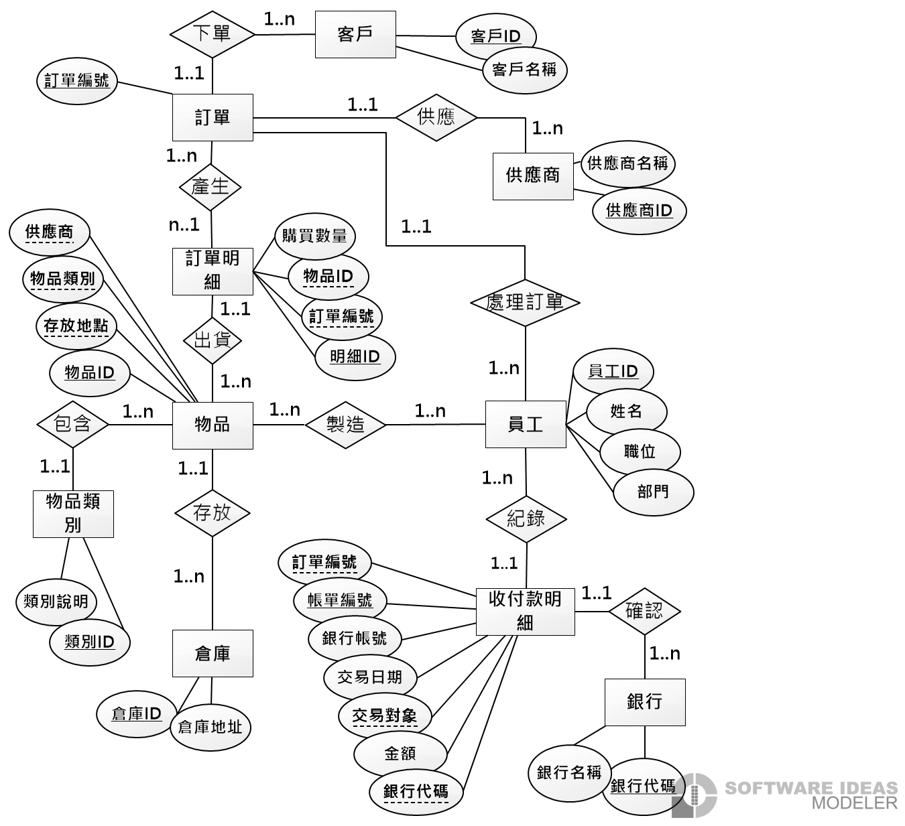

<!-- Version description:
  This version contains "Client" entity with extended relationships.
-->

# 礦業會計系統

---

最新文件與說明在[文件分支][document_edit branch]

[version_3 分支][version_3 branch] 將作為系統實作分支

---

資料庫系統期末專題

題目:礦業會計系統

指導教授:江季翰

組別:12

組員:

1. 41043118 呂昱諦
2. 41043116 吳枰樟
3. 41043136 俞漢威
4. 41043152 許書和

- [礦業會計系統](#礦業會計系統)
  - [應用情境](#應用情境)
  - [系統需求說明](#系統需求說明)
  - [使用案例](#使用案例)
    - [使用案例圖](#使用案例圖)
  - [ER-Diagram](#er-diagram)
  - [完整性限制](#完整性限制)
    - [實體](#實體)
    - [關聯](#關聯)
  - [實體與關聯之屬性及詳細說明](#實體與關聯之屬性及詳細說明)
    - [實體屬性](#實體屬性)
    - [關聯屬性](#關聯屬性)
    - [實體詳細說明](#實體詳細說明)
    - [關聯詳細說明](#關聯詳細說明)
  - [View 說明](#view-說明)
  - [使用者說明](#使用者說明)
  - [Schema](#schema)
    - [SQL](#sql)
    - [MariaDB Table Creation](#mariadb-table-creation)
    - [新增資料](#新增資料)
    - [建立 View](#建立-view)
    - [使用者建立及權限分配](#使用者建立及權限分配)
  - [資料表結果圖](#資料表結果圖)
  - [分工](#分工)
  - [參考資料](#參考資料)

## 應用情境

作為礦業開發公司所使用的會計系統，
本系統資料庫涵蓋材料、存貨、訂單、物品之儲存，
可延伸之應用為訂單、存貨、貿易、會計、管理系統等。

礦業進行開發時，可記錄採集到之天然礦物與員工生產之商品。
而礦業開發所運用到之各項器具、物品等，將儲存至資料庫中。
會計系統將以銷售、與進貨產生的訂單與付款收款明細來結算交易。

## 系統需求說明

本系統將存貨、材料、工具或裝置等以物品ID、物品類別、名稱、數量、
數量單位、單價、用途、存放倉庫、購置日期與供應商，儲存至物品資料表。
其中，存貨無需紀錄供應商、購置日期。

員工資料表儲存員工ID、員工姓名、所屬部門、職位與電子郵件，
其中員工部門與職位應依據事實填寫。

銀行資料表儲存了財金資訊股份有限公司接受的銀行機構，
作為財政部出資之機構，此來源應足以驗證極大部分屬於中華民國境內銀行代碼。

客戶與供應商資料表儲存了曾消費過的客戶與合作廠商，
系統會為新客戶、供應商產生一組客戶ID與供應商ID，
並儲存客戶與供應商名稱與電子郵件以利聯絡。

物品類別資料表儲存各類別ID與其說明。

倉庫資料表紀錄各倉庫ID與其地址，可依照需求填寫該倉庫備註。

<!-- 訂單 -->
客戶送出的訂單與向供應商的進貨單，將會由系統以下單日為基礎，
產生一組訂單編號，並記錄付款日期、付款方式，
並記錄客戶或供應商ID以區分客戶訂單與進貨單。

<!-- 訂單明細 -->
每筆訂單將由購買或銷售的物品，分別產生訂單明細，
每筆明細單紀錄訂單編號以標示其所屬訂單，並且由系統產生明細編號。
一筆明細只記錄一種物品、交易數量與該物品所對應的數量單位。
訂單金額由物品數量與其單價計算乘積，不記錄於訂單上。

<!-- 收付款明細 -->
每筆訂單在收到、給付款項之後，由財務部紀錄收付款明細。
每筆收付款明細由系統產生帳單編號、紀錄對應之訂單編號、
收付款帳號與其所屬之銀行代號、交易日期與金額。
會計系統將收付款明細結算交易時，應紀錄專責員工ID與帳單編號。

客戶與向供應商送出的訂單，皆由一位行銷部門或採購部門的專責員工負責。
客戶訂單與供應單應可依照需求，經過專責員工溝通後修改與撤銷。
客戶可透過客戶資訊，也就是Email、名稱或ID查詢訂單。

行銷與業務部門之行銷專員需可查詢客戶資料與商品列表，以利市場研究。
而業務專員負責處理客戶送出的訂單，客戶可依據需求與專員溝通後修改訂單，
訂單的撤銷應在與直屬業務主管彙整後予以刪除。

財務部門中，財務專員需查詢客戶是否付款，將已付款之訂單與資料記錄到收付款明細，
彙整給所屬主管後儲存置資料庫。

生產與營運部門中，生產工人應只可查看工具、商品或材料等物品，
否則得向直屬主管申請其他操作權限。儲存已生產商品時，
應紀錄負責倉儲的員工ID、物品ID、銷貨成本與製造日期，此處物品單價意指商品售價。

客服部門中，客服專員可尋找客戶訂單，若客戶要求修該訂單內容，
則需彙報給業務部門，由該筆訂單支專責員工處裡。

採購部門中，庫存管理員應能夠檢視材料的庫存量，
採購專員依照庫存管理與需求，向供應商送出採購訂單，
採購單的建立、修改與撤銷應向直屬主管彙整處理。

資訊部門中，程式設計師只能夠有限制的存取資料庫與操作資料庫系統，
需要近一步的權限需要向資料庫管理員或系統管理員申請。

人力資源部中，人力資源助理或其專員負責建立員工資料，
若員工提出修改需求，則專員得向直屬主管彙整後處理，
員工離職時，在主管確認後，將刪除申請報告給人力資源經理後予以刪除。

礦業部門中，各技師、工人應只有查看工具、裝備清單的權限，
若須採購新機具，則需向直屬主管報告後，向採購部門申請採購。

## 使用案例

<!-- @yee65569@gmail.com maintains this section-->
系統有八個部門:

1. 行銷與業務部門 (MSD)
2. 財務部門 (FD)
3. 生產與營運部門 (POD)
4. 客戶服務部門 (CSD)
5. 採購部門 (PD)
6. 資訊部門 (ITD)
7. 人力資源部門 (HRD)
8. 礦業部門 (MD)

**權限劃分說明**：

- **助理**：負責**新增**和**查詢**資料。
- **主管**：除了助理的權限外，還能**更新**資料。
- **經理**：擁有最高權限，包括新增、查詢、更新，以及在必要時**刪除**資料。

在此基礎上，您的系統使用案例可以簡化為：

1. **管理物品資料**：根據權限劃分，相關人員進行物品資料的新增、查詢、更新或刪除。
2. **處理訂單**：相應人員根據其權限創建、查詢、更新或取消訂單。
3. **財務管理**：財務相關人員進行收付款明細的記錄、查詢和交易結算。
4. **客戶管理**：行銷人員管理客戶資料，包括新增、查詢和更新。
5. **供應商管理**：採購人員管理供應商資料，進行新增、查詢和更新。
6. **倉庫管理**：倉庫人員負責物品的入庫、出庫和倉庫資料的管理。
7. **員工管理**：人力資源人員負責員工資料的新增、查詢和更新。
8. **市場研究**：行銷人員進行客戶資料與商品列表的查詢。
9. **生產管理**：生產人員記錄和查詢生產相關資料。
10. **客服支援**：客服人員根據權限協助客戶查詢和修改訂單。
11. **採購管理**：採購人員根據庫存需求發出採購訂單。
12. **系統維護**：系統管理人員負責系統功能的維護和更新。

---

<!-- Copilot 依照需求分析所產生的使用案例 -->
您的系統需求分析看起來是合理且有效的。以下是根據您的需求分析所產生的一些用例：

1. **用例1 - 建立新物品**：當有新的存貨、材料、工具或裝置進入時，系統會生成一個新的物品ID，並將相關資訊（如物品類別、名稱、數量、數量單位、單價、用途、存放倉庫、購置日期與供應商）儲存至物品資料表。

2. **用例2 - 建立新訂單**：當客戶或供應商送出訂單時，系統會生成一個新的訂單編號，並記錄付款日期、付款方式，以及客戶或供應商ID。

3. **用例3 - 建立訂單明細**：對於每筆訂單中購買或銷售的物品，系統會生成一個訂單明細，記錄訂單編號、物品、交易數量和該物品所對應的數量單位。

4. **用例4 - 紀錄收付款明細**：每筆訂單在收到、給付款項之後，由財務部紀錄收付款明細。每筆收付款明細由系統產生帳單編號、紀錄對應之訂單編號、交易對象、收付款帳號與其所屬之銀行代號、交易日期與金額。

5. **用例5 - 修改或撤銷訂單**：客戶或供應商可以根據需求修改或撤銷訂單。每筆訂單都由行銷部門或採購部門的專責員工負責。

6. **用例6 - 儲存商品**：當生產部門儲存商品時，應紀錄負責倉儲的員工ID、物品ID、銷貨成本與製造日期。

這些用例應該能夠涵蓋您的系統需求分析中提到的大部分功能。希望這對您有所幫助！😊

### 使用案例圖


## ER-Diagram



共有十個實體

1. 員工
2. 銀行
3. 客戶
4. 供應商
5. 物品類別
6. 倉庫
7. 物品
8. 訂單
9. 訂單明細
10. 收付款明細

共有十個關聯

1. 處理訂單
2. 製造
3. 紀錄
4. 下單
5. 供應
6. 出貨
7. 包含
8. 存放
9. 確認
10. 產生

## 完整性限制

### 實體

1. 員工
    <!-- TODO: 員工增加EMAIL -->
    1. 員工ID:長度為11的大寫英數字串，不可為空，格式為 `DEP-POS-ID`
        1. 三個部分以 `-` 符號分隔，字母皆為大寫。
        2. `DEP` 代表部門，以1至3位大寫英文字母編碼。
        3. `POS` 代表職位，以1至3位大寫英文字母編碼。
        4. `ID` 為3位大寫英文字母與數字編碼。
        5. 縮寫舉例列於 [實體詳細說明](#實體詳細說明)
    2. 部門:長度為10的中文字串，須符合公司內的部門名稱，不可為空。
    3. 職位:長度為10的中文字串，須符合公司內的職位名稱，不可為空。
    4. 姓名:長度為10的中文字串，須符合姓氏+名字順序，不可為空。
    5. 員工電子郵件:長度為23的字串，不可為空，格式為 `DEP-POS-ID@company.com`
       1. 四個部分以 `@` 和 `-` 符號分隔，字母皆為小寫。
       2. `DEP` 代表部門，以1至3位大寫英文字母編碼。
       3. `POS` 代表職位，以1至3位大寫英文字母編碼。
       4. `ID` 為3位大寫英文字母與數字編碼。
       5. `company.com` 為公司的電子郵件網域，固定為"company.com"。
       6. 舉例列於 [實體詳細說明](#實體詳細說明)

2. 銀行
    1. 銀行代碼:長度為7的數字串，不可為空。
        1. 格式為 `金融機構總代號` `分支機構代號`，皆可由`0`開頭。
        2. `金融機構總代號` 為3碼數字
        3. `分支機構代號` 為4碼數字
        4. `金融機構總代號` 可單獨存在，`分支機構代號`必須接在其後。
        5. `金融機構總代號` 與 `分支機構代號` 同時存在時，中間不須連接符號
        6. 驗證是否為合法來源: [財金資訊股份有限公司 總分支機構查詢](https://www.fisc.com.tw/TC/Service?CAID=51254999-5d15-4ddf-8e54-4b2cdb2a8399)
    2. 銀行名稱:長度為30的中文字串，不可為空。
        1. 需為中華民國登記在案的銀行名稱。
        2. 參考來源: [財金資訊股份有限公司 總分支機構查詢](https://www.fisc.com.tw/TC/Service?CAID=51254999-5d15-4ddf-8e54-4b2cdb2a8399)
3. 客戶
    <!-- TODO: 客戶增加EMAIL -->
    1. 客戶ID:長度為10的大寫英數字串， 格式為 `Client-ID`， 不可為空。
        1. `Client` 為6個字元之大寫字母 `CLIENT`
        2. 第七個字元為 `-`
        3. `ID` 為長度三且隨機的大寫英數字串， `[A-Z0-9]{3}`
    2. 客戶名稱:長度為30的中文字串， 不可為空
    3. 客戶電子郵件:長度為小於77的字串，格式為 `local-part@domain`，不可為空。
       1. `local-part`與`domain`以 `@`分隔
       2. `local-part` 為小於64個字元之字串，只可包含大小寫字母、0~9、特殊字元 ``!#$%&'*+-/=?^_`{|}~``
       3. `domain`只接受以下域名
          1. yahoo.com、yahoo.com.tw
          2. gmail.com
          3. outlook.com、hotmail.com、live.com、msn.com
       4. 舉例列於 [實體詳細說明](#實體詳細說明)

4. 供應商
    <!-- TODO: 供應商增加EMAIL -->
    1. 供應商ID:長度為6的大寫英數字串， 格式為 `Supplier-ID`， 不可為空
        1. `Supplier` 為三個大寫字母`SUP`
        2. 第四個字元為 `-`
        3. `ID` 為長度二且隨機的大寫英數字串， `[A-Z0-9]{2}`
    2. 供應商名稱:長度為50的中文字串， 不可為空
        1. 需符合登記在經濟部公司法人名稱
    3. 供應商電子郵件:長度小於253的字串，格式為 `local-part@domain`，不可為空。
       1. `local-part`與`domain`以 `@`分隔
       2. `local-part` 為小於64個字元之字串，只能包含大小寫字母、0~9、特殊字元 ``!#$%&'*+-/=?^_`{|}~``
       3. `domain`由三個標籤組成，每個標籤以`.`字元分隔，格式為 `third-level.second-level.top-level`
          1. 每個標籤只能由大小寫字母、`-`字元與數字組成，`-`字元不可作為開頭與結尾，且不超過63個字元
          2. 至少要有`top-level` 與 `second-level`
          3. `top-level` 域名不可由數字開頭
       4. 舉例列於 [實體詳細說明](#實體詳細說明)

5. 物品類別
    1. 物品類別ID:長度為7的大寫英數字串，格式為 `CAT-No`， 不可為空
        1. 兩個部分 `CAT` 與 `itmeID` 之間以 `-` 字元分隔
        2. `CAT` 為固定的三個大寫字母：CAT
        3. `No` 為隨機三位整數，`000`至 `999`。
    2. 類別說明， 不可為空
        1. 長度為10的中文字串，如礦石類、工具類、材料類，預設值為未分類。

6. 倉庫
    1. 倉庫ID:長度為7的大寫英數字串，格式為 `WH-ID`，不可為空。
        1. 前2個字元固定為 `WH`
        2. 第3個字元為 `-` 作為分隔符號
        3. `ID`為四個數字字元，`0000`至 `9999`
    2. 倉庫地址:不超過70字元字串，格式為 `縣市-鄉鎮市區-村里-道路街名-巷-弄-號-樓-室`，不可為空。
    3. 倉庫備註:不超過100字元字串，可為空。

7. 物品
    <!-- TODO: 單位增加"公克" -->
    1. 物品ID:長度為15的大寫英數字串， 不可為空
        1. `[A-Z]{5}[0-9]{10}`
        2. 無連接符號
        3. 前五碼為大寫英文AAAAA~ZZZZZ
        4. 後十碼為正整數0000000000~9999999999。
    2. 物品類別ID:長度為7的字串，格式為 `CAT-No`， 參考 `物品類別實體之類別ID`
    3. 物品名稱:長度為50的字串，不可為空。
    4. 物品數量:正浮點數，不可為空，預設值為0.0。
        1. 若物品類別無法以個數計數時，單位為公斤
        2. 物品數量單位不另外分類與紀錄
    5. 數量單位:四個字元的字串，只可為以下字串。不可為空。
        1. "公斤"、"公尺"、"立方公尺"、"平方公尺"、"個"、"單位"。
        2. 對應物品類別選擇適當的單位。
    6. 物品單價:正整數，不可為空，預設值為0。
    7. 用途:長度為50的字串，可為空，預設值為NULL。
    8. 存放地點:長度為7的字串，參考`倉庫實體之倉庫ID`，不可為空。
    9. ~~購置日期:只儲存年月日，不得小於公司建立日期，預設值為NULL。~~
        1. ~~格式為 `yyyy-MM-dd`~~
    10. 供應商:長度為6的字串， 參考`供應商實體之供應商ID`。

8. 訂單
    <!-- TODO: 交易對象拆分為交易客戶與交易廠商的參考，只能存在一欄 -->
    1. 訂單編號:長度為12的字串，格式為 `DATE-OrderId`。
        1. `DATE` 為下單日期， 長度為8的數字字串， 格式為 `YYYYMMDD`， 紀錄年月日
        2. 第9碼為字元 `-`
        3. `OrderId` 為3碼隨機， 包含大小寫的英文字母及數字
    2. 付款日期:儲存日期時間，不得小於從公司建立日期， 可為空，預設值為NULL。
        1. 格式為 `yyyy-MM-dd`
    3. 付款方式:長度為2的中文字串，只可為 "匯款"或"付現"，不可為空。
    4. 交易客戶:長度為10的字串，參考 `客戶實體之客戶ID`，可為空。
        1. 若`交易供應商`為空，此項目不可為空。
    5. 交易供應商:長度為6的字串，參考 `供應商實體之供應商ID`，可為空。
        1. 若`交易客戶`為空，此項目不可為空。

9. 訂單明細
    1. 明細ID:長度為15的字串，格式為 `DATE-OrderId-Detail`。
        1. 三個部分以 `-` 字元分隔
        2. `DATE` 為下單日期， 長度為8的數字字串， 格式為 `YYYYMMDD`， 紀錄年月日
        3. `OrderId` 為3碼隨機， 包含大小寫的英文字母及數字
        4. `Detail` 為2碼正整數，範圍由 00至99
    2. 訂單編號:長度為12的字串，格式為 `DATE-OrderId`。
        1. `DATE` 為下單日期， 長度為8的數字字串， 格式為 `YYYYMMDD`， 紀錄年月日
        2. 第9碼為字元 `-`
        3. `OrderId` 為3碼隨機， 包含大小寫的英文字母及數字
    3. 交易商品:長度為15的大寫英數字串，參考 `物品實體之物品ID`
    4. 交易數量:正浮點數，不可為空。
        1. 對應`物品類別`，若為可數之物品，小數點後應為零。
    5. 數量單位:四個字元的字串，只可為以下字串。不可為空。
        1. "公斤"、"公尺"、"立方公尺"、"平方公尺"、"個"、"單位"。
        2. 對應物品類別選擇適當的單位。

10. 收付款明細
    1. 帳單編號:長度為10的字母與數字，不可為空。格式如下。
        1. `^[A-Za-z0-9]{3}-[0-9]{6}$`
        2. 前3碼為隨機的英文字母及數字
        3. 第4碼為字元"-"
        4. 後6碼為隨機的數字
    2. 訂單編號:長度為12的字串，參考`訂單實體之訂單編號`，格式為 `DATE-OrderId`。
        1. `DATE` 為下單日期， 長度為8的數字字串， 格式為 `YYYYMMDD`， 紀錄年月日
        2. 第9碼為字元 `-`
        3. `OrderId` 為3碼隨機， 包含大小寫的英文字母及數字
    3. 銀行代號:長度為3的字串， 參考 `銀行實體之銀行代號`。
        1. 若該筆訂單非轉匯款支付，不可為空。
    4. 銀行帳號:長度為14的數字字串，7+7(局號+帳號)。
        1. 若該筆訂單非轉匯款支付，不可為空。
    5. 交易日期:只儲存年月日，不得小於從公司建立日期，預設值為NULL。
        1. 格式為 `yyyy-MM-dd`
    6. 金額:正整數，不可為空

### 關聯

1. 訂單處理關係
    <!-- 員工處裡訂單 -->
    1. 訂單編號:長度為12的字串，格式為 `DATE-OrderId`，參考`訂單實體之訂單編號`。
        1. `DATE` 為下單日期， 長度為8的數字字串， 格式為 `YYYYMMDD`， 紀錄年月日
        2. 第9碼為字元 `-`
        3. `OrderId` 為3碼隨機， 包含大小寫的英文字母及數字
    2. 員工ID:長度為10的字串，不可為空，格式為`DEP-POS-ID`，參考`員工實體之員工ID`

2. 出貨關係
    <!-- 物品提供給訂單 -->
    1. 物品ID:長度為15的大寫英數字串， 不可為空
        1. `[A-Z]{5}[0-9]{10}`
        2. 前五碼為大寫英文AAAAA~ZZZZZ
        3. 後十碼為正整數0000000000~9999999999。
    2. 訂單編號:長度為12的字串，格式為 `DATE-OrderId`，參考`訂單實體之訂單編號`。

3. 下單關係
    <!-- 客戶下定訂單 -->
    1. 客戶ID:長度為10的大寫英數字串，格式為 `Client-ID`，參考`客戶實體之客戶ID`。
    2. 訂單編號:長度為12的字串，格式為 `DATE-OrderId`，參考`訂單實體之訂單編號`。

4. 製造關係
    1. 員工ID:長度為10的字串，不可為空，格式為`DEP-POS-ID`。
    2. 物品ID:長度為15的字串，格式如前述。
    3. 製造數量:正浮點數，商品可能為不可數物品。
    4. 製造日期:儲存日期時間，可為空，不得小於從公司建立日期，預設值為輸入資料當日。
        1. 格式為 `yyyy-MM-dd`
    5. 銷貨成本:正整數，包含零，預設值為NULL。

5. 紀錄關係
    1. 員工ID:長度為10的字串，不可為空，格式為`DEP-POS-ID`。
    2. 帳單編號:長度為10的字母與數字，參考`收付款明細實體之帳單編號`。
       1. 格式為 `^[A-Za-z0-9]{3}-\d{6}$`

6. 供應關係
    <!-- 採購部向供應商進貨 -->
    1. 供應商ID:長度為6的大寫英數字串，參考`供應商實體之供應商ID`。
    2. 訂單編號:長度為12的字串，格式為 `DATE-OrderId`，參考`訂單實體之訂單編號`。

7. 包含關係
    <!-- 物品屬於對應類別 -->
    1. 物品ID:長度為15的字串，參考`物品實體之物品ID`。
    2. 類別ID:長度為7的字串，格式為 `CAT-No`， 參考 `物品類別ID`

8. 存放關係
    <!-- 物品存放在指定的倉庫 -->
    1. 倉庫ID:長度為7的字串，參考`倉庫實體之倉庫ID`。
    2. 物品ID:長度為15的字串，參考`物品實體之物品ID`。

9. 確認關係
    1. 帳單編號:長度為10的字母與數字，參考`收付款明細實體之帳單編號`。
    2. 銀行代號:長度為3的字串， 參考 `銀行實體之銀行代號`。

10. 產生關係
    1. 訂單編號:長度為12的字串，格式為 `DATE-OrderId`，參考`訂單實體之訂單編號`。
    2. 明細ID:長度為15的字串，格式為 `DATE-OrderId-Detail`，參考`訂單明細實體之明細ID`。

## 實體與關聯之屬性及詳細說明

此段僅列出實體所擁有之屬性，
說明列於[實體詳細說明](#實體詳細說明)

### 實體屬性

| 實體 | 屬性         | Key           |
| ---- | ------------ | ------------- |
| 員工 | 員工ID       | Primary Key   |
|      | 姓名         |               |
|      | 部門         |               |
|      | 職位         |               |
|      | 員工電子郵件 | Alternate Key |

| 實體 | 屬性     | Key           |
| ---- | -------- | ------------- |
| 銀行 | 銀行代號 | Primary Key   |
|      | 銀行名稱 | Alternate Key |

| 實體 | 屬性         | Key           |
| ---- | ------------ | ------------- |
| 客戶 | 客戶ID       | Primary Key   |
|      | 客戶名稱     |               |
|      | 客戶電子郵件 | Alternate Key |

| 實體   | 屬性           | Key           |
| ------ | -------------- | ------------- |
| 供應商 | 供應商ID       | Primary Key   |
|        | 供應商名稱     | Alternate Key |
|        | 供應商電子郵件 | Alternate Key |

| 實體     | 屬性       | Key         |
| -------- | ---------- | ----------- |
| 物品類別 | 物品類別ID | Primary Key |
|          | 類別說明   |             |

| 實體 | 屬性     | Key           |
| ---- | -------- | ------------- |
| 倉庫 | 倉庫ID   | Primary Key   |
|      | 倉庫地址 | Alternate Key |
|      | 倉庫備註 |               |

| 實體   | 屬性         | Key           |
| ------ | ------------ | ------------- |
| 物品   | 物品ID       | Primary Key   |
|        | 物品類別ID   | Foreign Key   |
|        | 物品名稱     | Alternate Key |
|        | 物品數量     |               |
|        | 數量單位     |               |
|        | 物品單價     |               |
|        | 用途         |               |
|        | 存放地點     | Foreign Key   |
| 已刪除 | ~~購置日期~~ |               |
|        | 供應商       | Foreign Key   |

| 實體 | 屬性       | Key         |
| ---- | ---------- | ----------- |
| 訂單 | 訂單編號   | Primary Key |
|      | 付款日期   |             |
|      | 付款方式   |             |
|      | 交易客戶   | Foreign Key |
|      | 交易供應商 | Foreign Key |

| 實體     | 屬性     | Key         |
| -------- | -------- | ----------- |
| 訂單明細 | 明細ID   | Primary Key |
|          | 訂單編號 | Foreign Key |
|          | 物品ID   | Foreign Key |
|          | 購買數量 |             |
|          | 數量單位 |             |

| 實體       | 屬性     | Key           |
| ---------- | -------- | ------------- |
| 收付款明細 | 帳單編號 | Primary Key   |
|            | 訂單編號 | Foreign Key   |
|            | 銀行代號 | Foreign Key   |
|            | 銀行帳號 | Alternate Key |
|            | 交易日期 |               |
|            | 金額     |               |

### 關聯屬性

1. 訂單處理關係
    | 關聯     | 關聯實體 | 關聯實體 | Cardinality | 說明                                                     |
    | -------- | -------- | -------- | ----------- | -------------------------------------------------------- |
    | 訂單處理 | 訂單     | 員工     | 多對一      | 多筆訂單可以被同一個員工處理，每筆訂單只能由一個員工處理 |

    員工 -> 訂單: 1..n

    訂單 -> 員工: 1..1

    | 關聯     | 屬性     | Key         |
    | -------- | -------- | ----------- |
    | 訂單處理 | 訂單編號 | Foreign Key |
    |          | 員工ID   | Foreign Key |

2. 出貨關係
    | 關聯 | 關聯實體 | 關聯實體 | Cardinality | 說明                                                     |
    | ---- | -------- | -------- | ----------- | -------------------------------------------------------- |
    | 出貨 | 訂單明細 | 物品     | 多對一      | 多筆訂單明細可以出貨同一個物品，每筆訂單明細只有一個物品 |

    物品 -> 訂單明細: 1..n

    訂單明細 -> 物品: 1..1

    | 關聯 | 屬性   | Key         |
    | ---- | ------ | ----------- |
    | 出貨 | 物品ID | Foreign Key |
    |      | 明細ID | Foreign Key |

3. 下單關係
    | 關聯 | 關聯實體 | 關聯實體 | Cardinality | 說明                                                     |
    | ---- | -------- | -------- | ----------- | -------------------------------------------------------- |
    | 下單 | 訂單     | 客戶     | 多對一      | 一個客戶可以送出多筆訂單，且每個訂單都只對應到一個客戶 |

    客戶 -> 訂單: 1..n

    訂單 -> 客戶: 1..1

    | 關聯 | 屬性     | Key         |
    | ---- | -------- | ----------- |
    | 下單 | 客戶ID   | Foreign Key |
    |      | 訂單編號 | Foreign Key |

4. 產生關係
    | 關聯 | 關聯實體 | 關聯實體 | Cardinality | 說明                                                     |
    | ---- | -------- | -------- | ----------- | -------------------------------------------------------- |
    | 產生 | 訂單明細 | 訂單     | 多對一      | 一筆訂單可以產生多張訂單明細，每張明細只會對應到一筆訂單 |

    訂單 -> 訂單明細: 1..n

    訂單明細 -> 訂單: 1..1

    | 關聯 | 屬性       | Key         |
    | ---- | ---------- | ----------- |
    | 產生 | 訂單明細ID | Foreign Key |
    |      | 訂單編號   | Foreign Key |

5. 製造關係
    | 關聯 | 關聯實體 | 關聯實體 | Cardinality | 說明                                                       |
    | ---- | -------- | -------- | ----------- | ---------------------------------------------------------- |
    | 製造 | 物品     | 員工     | 多對多      | 一個員工會可以負責製造多個商品，且一個商品可由多位員工負責 |

    物品 -> 員工: 1..n

    員工 -> 物品: 1..1

    | 關聯 | 屬性     | Key         |
    | ---- | -------- | ----------- |
    | 製造 | 員工ID   | Foreign Key |
    |      | 物品ID   | Foreign Key |
    |      | 製造數量 |             |
    |      | 銷貨成本 |             |
    |      | 製造日期 |             |

6. 紀錄關係
    | 關聯 | 關聯實體 | 關聯實體   | Cardinality | 說明                                                                 |
    | ---- | -------- | ---------- | ----------- | -------------------------------------------------------------------- |
    | 紀錄 | 員工     | 收付款明細 | 多對一      | 一個員工會可以負責紀錄多筆收付款明細，且一個明細只會由一位員工負責。 |

    員工 -> 收付款明細: 1..n

    收付款明細 -> 員工: 1..1

    | 關聯 | 屬性     | Key         |
    | ---- | -------- | ----------- |
    | 紀錄 | 員工ID   | Foreign Key |
    |      | 帳單編號 | Foreign Key |

7. 供應關係
    | 關聯 | 關聯實體 | 關聯實體 | Cardinality | 說明                                                         |
    | ---- | -------- | -------- | ----------- | ------------------------------------------------------------ |
    | 供應 | 訂單   | 供應商     | 多對一      | 一間供應商可以供應多筆訂單，且每個訂單都只對應到一間供應商。 |

    訂單 -> 供應商: 1..n

    供應商 -> 訂單: 1..1

    | 關聯 | 屬性     | Key         |
    | ---- | -------- | ----------- |
    | 供應 | 供應商ID | Foreign Key |
    |      | 訂單編號 | Foreign Key |

8. 包含關係
    | 關聯 | 關聯實體 | 關聯實體 | Cardinality | 說明                                                         |
    | ---- | -------- | -------- | ----------- | ------------------------------------------------------------ |
    | 包含 | 物品類別 | 物品     | 多對一      | 一個物品類別可以包含多種物品，且一種物品只屬於一項物品類別。 |

    物品 -> 物品類別: 1..n

    物品類別 -> 物品: 1..1

    | 關聯 | 屬性   | Key         |
    | ---- | ------ | ----------- |
    | 包含 | 物品ID | Foreign Key |
    |      | 類別ID | Foreign Key |

9. 存放關係
    | 關聯 | 關聯實體 | 關聯實體 | Cardinality | 說明                                                     |
    | ---- | -------- | -------- | ----------- | -------------------------------------------------------- |
    | 存放 | 物品     | 倉庫     | 多對一      | 多種物品可以存放到一個倉庫，每種物品只存放在一個倉庫中。 |

    物品 -> 倉庫: 1..n

    倉庫 -> 物品: 1..1

    | 關聯 | 屬性   | Key         |
    | ---- | ------ | ----------- |
    | 存放 | 倉庫ID | Foreign Key |
    |      | 物品ID | Foreign Key |

10. 確認關係
    | 關聯 | 關聯實體   | 關聯實體 | Cardinality | 說明                                                         |
    | ---- | ---------- | -------- | ----------- | ------------------------------------------------------------ |
    | 確認 | 收付款明細 | 銀行     | 多對一      | 多筆明細可對照到一間銀行，但每筆收付款明細只對應到一家銀行。 |

    銀行 -> 收付款明細: 1..n

    收付款明細 -> 銀行: 1..1

    | 關聯 | 屬性     | Key         |
    | ---- | -------- | ----------- |
    | 確認 | 帳單編號 | Foreign Key |
    |      | 銀行代號 | Foreign Key |

### 實體詳細說明

| 實體 | 屬性         | Key           | Domain                                              | 說明                                                                        |
| ---- | ------------ | ------------- | --------------------------------------------------- | --------------------------------------------------------------------------- |
| 員工 | 員工ID       | Primary Key   | 格式為 `DEP-POS-ID`                                 | 員工的ID，`DEP` 代表部門、`POS` 代表職位、`ID`為編號。                      |
|      |              |               | `^[A-Z]{1，3}-[A-Z]{1，3}-[A-Z0-9]{3}$`             | 部門、職位依據員工實際資料，編號由程式產生。                                |
|      |              |               |                                                     | `ID` 能為各部門的不同職位提供 46656 個員工ID。                              |
|      | 姓名         |               | 長度為10的中文字串                                  | 員工的姓名。                                                                |
|      | 部門         |               | 長度為10的中文字串                                  | 員工部門，該部門需存在於公司中。                                            |
|      | 職位         |               | 長度為10的中文字串                                  | 員工職位，該職位需存在於公司中。                                            |
|      | 員工電子郵件 | Alternate Key | 格式為 `DEP-POS-ID@company.com`                     | 以`員工ID`為地址(local part)建立的電子郵件，域名(domain)皆為 `@company.com` |
|      |              |               | `^[A-Z]{1，3}-[A-Z]{1，3}-[A-Z0-9]{3}@company.com$` | 此電子郵件在編入`員工ID`時建立                                              |

- 員工ID範例: POD-BL-A00
- 員工電子郵件範例: <POD-BL-A00@company.com>

部門與職位縮寫範例

1. `MSD`: Marketing and Sales Department，行銷與銷售部門
   1. `MD`: Marketing Director , 行銷總監
   2. `MMG`: Marketing Manager , 行銷經理
   3. `MCO`: Marketing Coordinator , 行銷協調員
   4. `MAN`: Marketing Analyst , 行銷分析師
   5. `MS`: Marketing Specialist , 行銷專員
   6. `SD`: Sales Director , 銷售總監
   7. `SMG`: Sales Manager , 銷售經理
   8. `SRE`: Sales Representative , 銷售代表
   9. `SS`: Sales Specialist , 銷售專員
   10. `SC`: Sales Consultant , 銷售顧問
2. `FD`: Finance Department，財務部門
    1. `FMG`: Finance Manager , 財務經理
    2. `FAN`: Financial Analyst , 財務分析師
    3. `FCO`: Financial Controller , 財務控制員
    4. `FCL`: Finance Clerk , 財務文員
    5. `FAD`: Financial Advisor , 財務顧問
    6. `FM`: Finance Manager , 財務經理
    7. `ACC`: Accountant , 會計師
    8. `FA`: Financial Analyst , 財務分析師
    9. `AUD`: Auditor , 審計員
    10. `CON`: Controller , 控制員
    11. `TRE`: Treasurer , 財務主管
    12. `BA`: Budget Analyst , 預算分析師
    13. `TS`: Tax Specialist , 稅務專員
    14. `PC`: Payroll Clerk , 工資管理員
3. `POD`: Production/Operations Department， 生產運營部門
    1. `OMG`: Operations Manager , 運營經理
    2. `PMG`: Production Manager , 生產經理
    3. `OAN`: Operations Analyst , 運營分析師
    4. `PPL`: Production Planner , 生產規劃員
    5. `OM`: Operations Manager , 運營經理
    6. `PS`: Production Supervisor , 生產主管
    7. `WHS`: Warehouse Specialist , 倉管人員
    8. `IM`: Inventory Manager , 庫存經理
    9. `PM`: Plant Manager , 工廠經理
    10. `PW`: Production Worker , 生產工人
    11. `QCS`: Quality Control Specialist , 品質控制專員
    12. `PP`: Production Planner , 生產計劃員
    13. `LC`: Logistics Coordinator , 物流協調員
    14. `OA`: Operations Analyst , 運營分析師
    15. `QAM`: Quality Assurance Manager , 品質保證經理
4. `CSD`: Customer Service Department，客戶服務部門
    1. `CSM`: Customer Service Manager , 客戶服務經理
    2. `CSR`: Customer Service Representative , 客戶服務代表
    3. `CSS`: Customer Support Specialist , 客戶支援專員
    4. `CEM`: Customer Experience Manager , 客戶體驗經理
    5. `CSR`: Customer Service Representative , 客服代表
    6. `HDS`: Help Desk Specialist , 幫助台專員
    7. `CSM`: Customer Service Manager , 客服經理
    8. `CCA`: Call Center Agent , 服務中心代理
    9. `TSS`: Technical Support Specialist , 技術支援專員
    10. `AM`: Account Manager , 客戶經理
    11. `CRM`: Client Relations Manager , 客戶關係經理
    12. `SDA`: Service Desk Analyst , 服務台分析師
    13. `CSE`: Customer Support Engineer , 客戶支援工程師
    14. `CEM`: Customer Experience Manager , 客戶體驗經理
5. `PD`: Purchasing Department，採購部門
    1. `PMG`: Purchasing Manager , 採購經理
    2. `PAG`: Purchasing Agent , 採購代理人
    3. `PCS`: Procurement Specialist , 採購專員
    4. `PCL`: Purchasing Clerk , 採購文員
    5. `PAN`: Procurement Analyst , 採購分析師
    6. `PM`: Purchasing Manager , 採購經理
    7. `BUY`: Buyer , 採購員
    8. `PS`: Procurement Specialist , 採購專員
    9. `PC`: Purchasing Clerk , 採購文員
    10. `SCA`: Supply Chain Analyst , 供應鏈分析師
    11. `VM`: Vendor Manager , 供應商經理
    12. `PRM`: Procurement Manager , 採購經理
    13. `PCO`: Purchasing Coordinator , 採購協調員
    14. `ICS`: Inventory Control Specialist , 庫存控制專員
    15. `PA`: Purchasing Agent , 採購代理
6. `ITD`: IT Department，資訊科技部門
    1. `ITM`: IT Manager , IT經理
    2. `ITT`: IT Technician , IT技術員
    3. `NEN`: Network Engineer , 網絡工程師
    4. `SDE`: Software Developer , 軟件開發人員
    5. `ISS`: IT Support Specialist , IT支援專員
    6. `ITM`: IT Manager , IT經理
    7. `SA`: Systems Administrator , 系統管理員
    8. `NE`: Network Engineer , 網絡工程師
    9. `DBA`: Database Administrator , 數據庫管理員
    10. `ISS`: IT Support Specialist , IT支援專員
    11. `SD`: Software Developer , 軟件開發員
    12. `ITA`: IT Analyst , IT分析師
    13. `IPM`: IT Project Manager , IT項目經理
    14. `SEC`: Security Analyst , 安全分析師
    15. `WD`: Web Developer , 網頁開發員
7. `HRD`: Human Resources Department，人力資源部門
    1. `HRS`: Human Resources Specialist , 人力資源專員
    2. `HRM`: Human Resources Manager , 人力資源經理
    3. `RS`: Recruitment Specialist , 招聘專員
    4. `TC`: Training Coordinator , 培訓協調員
    5. `BA`: Benefits Administrator , 福利管理員
    6. `HRA`: HR Analyst , 人力資源分析師
    7. `ERM`: Employee Relations Manager , 員工關係經理
    8. `HRC`: HR Consultant , 人力資源顧問
    9. `PS`: Payroll Specialist , 薪資專員
    10. `HRA`: HR Assistant , 人力資源助理
8. `MD`: Mine Department，礦業部門
    1. `MBW`: Mine Blaster Worker , 礦山爆破工
    2. `UM`: Underground Miner , 地下礦工
    3. `HEO`: Heavy Equipment Operator , 重型設備操作員
    4. `DR`: Driller , 鑽孔員
    5. `EL`: Electrician , 電工
    6. `MTP`: Material Planner , 材料規劃師
    7. `HSS`: Health and Safety Specialist , 健康與安全專員
    8. `MNM`: Mine Manager , 礦山經理
    9. `CH`: Chemist , 化學家
    10. `GE`: Geological Engineer , 地質工程師

| 實體 | 屬性     | Domain                                 | 說明                                                                                                             |
| ---- | -------- | -------------------------------------- | ---------------------------------------------------------------------------------------------------------------- |
| 銀行 | 銀行代號 | 格式為 `金融機構總代號` `分支機構代號` | 客戶付款的銀行帳號代碼                                                                                           |
|      |          | `^([0-9]{3}\|[0-9]{7})$`               | 通常只需`銀行代號`(金融機構總代號)，在填入`分支代號`(分支機構代號)時，需確認是否有總代號，因銀行分部代號不唯一。 |
|      |          |                                        | 最後將與銀行列表確認是否為合法代碼，若不存在則為錯誤代號。                                                       |
|      |          |                                        | 已蒐集之包含分支機構銀行列表總數，為5292間                                                                       |
|      | 銀行名稱 | 長度為30的中文字串                     | 由`金融機構總代號`或其`分支機構代號`對應之機構名稱，用於說明銀行代號                                             |

- 004可單獨輸入，代表臺灣銀行，0040093為臺灣銀行臺南分行。
- 0093不可單獨使用，因銀行分部代號不唯一。

| 實體 | 屬性         | Domain                                                                                                       | 說明                                               |
| ---- | ------------ | ------------------------------------------------------------------------------------------------------------ | -------------------------------------------------- |
| 客戶 | 客戶ID       | 格式為 `Client-ID`                                                                                           | 每位新客戶將由程式產生隨機`ID`並儲存至`客戶`資料表 |
|      |              | `^CLIENT-[A-Z0-9]{3}$`                                                                                       | 此格式可記錄46656位客戶                            |
|      | 客戶名稱     | 長度為30的中文字串                                                                                           | 考慮可能為個人與法人(公司)而設定此長度             |
|      | 客戶電子郵件 | 格式為 `local-part@domain`                                                                                   | 客服部門將透過此電子郵件聯絡客戶                   |
|      |              | ``local-part = ^[a-zA-Z0-9!#$%&'*+-/=?^_`{\|}~]{1,64}``                                                      | 客戶電子郵件只接受yahoo、gmail、outlook、hotmail、ms live與msn信箱 |
|      |              | ```domain  = (yahoo\.com\|yahoo\.com\.tw\|gmail\.com \| outlook\.com\|hotmail\.com\|live\.com\|msn\.com)$``` |                                                    |
<!-- ^[a-zA-Z0-9!#$%&'*+\-\/=?^_`{|}~]{1,64}@(yahoo\.com|yahoo\.com\.tw|gmail\.com|outlook\.com|hotmail\.com|live\.com|msn\.com)$ -->

- 客戶ID範例:
  - CLIENT-A00
- 客戶電子郵件範例:
  - <CLIENT-A00@gmail.com>
  - <customer/mail@gmail.com>

| 實體   | 屬性           | Domain                                                                    | 說明                               |
| ------ | -------------- | ------------------------------------------------------------------------- | ---------------------------------- |
| 供應商 | 供應商ID       | 格式為 `Supplier-ID`                                                      | 新合作的供應商，其ID由程式隨機產生 |
|        |                | `^SUP-[A-Z0-9]{2}$`                                                       | 此編號可記錄1296個合作供應商       |
|        | 供應商名稱     | 長度為50的中文字串                                                        | 需符合登記在經濟部公司法人名稱     |
|        | 供應商電子郵件 | 格式為 `local-part@domain`                                                | 採購部門將透過此電子郵件聯絡供應商 |
|        |                | local-part ``^(?=.{1,253}$)([a-zA-Z0-9!#$%&'*+\-\/=?^_`{\|}~]{1,64})``    | 網域將可接受大部分的公司電子郵件信箱|
|        |                | domain ``((?!-)[a-zA-Z0-9-]{1,63}(?<!-)\.)+((?!-)[a-zA-Z-]{1,63}(?<!-))$`` |                                    |
<!-- ^(?=.{1,253}$)([a-zA-Z0-9!#$%&'*+\-\/=?^_`{|}~]{1,64})@((?!-)[a-zA-Z0-9-]{1,63}(?<!-)\.)+((?!-)[a-zA-Z-]{1,63}(?<!-))$ -->
供應商ID範例: SUP-A0
客戶電子郵件範例: <GSS@gss.com.tw>

| 實體     | 屬性       | Domain             | 說明                               |
| -------- | ---------- | ------------------ | ---------------------------------- |
| 物品類別 | 物品類別ID | 格式為 `CAT-No`    | 由程式為各類物品類別分配隨機ID     |
|          |            | `^CAT-[0-9]{3}$`   | 此格式可記錄1000種類別             |
|          | 類別說明   | 長度為10的中文字串 | 類別ID的說明欄為，說明該代號的類別 |

物品類別ID範例: CAT-000
客戶電子郵件範例: <a-company@mail.com.tw>

類別說明範例

1. 礦石類
2. 工具類
3. 材料類
4. 未分類

| 實體 | 屬性     | Domain                                              | 說明                         |
| ---- | -------- | --------------------------------------------------- | ---------------------------- |
| 倉庫 | 倉庫ID   | 格式為 `WH-ID`                                      | 每間倉庫由程式隨機分配ID     |
|      |          | `^WH-[0-9]{4}$`                                     | 此格式可記錄10000個倉庫       |
|      | 倉庫地址 | 格式為 `縣市-鄉鎮市區-村里-道路街名-巷-弄-號-樓-室` | 倉庫實際地址，按照其格式填寫 |
|      | 倉庫備註 | 不超過100字元字串                                   | 說明該倉庫的備註             |

倉庫ID範例: WH-0000

| 實體 | 屬性         | Domain                                   | 說明                                                  |
| ---- | ------------ | ---------------------------------------- | ----------------------------------------------------- |
| 物品 | 物品ID       | `[A-Z]{5}[0-9]{10}`                      | 物品的編號，由程式產生                                |
|      |              |                                          | 此格式可記錄11，881，376，000，000，000種物品         |
|      | 物品類別ID   | 長度為7的字串                            | 物品對應的類別所屬之類別ID                            |
|      | 物品名稱     | 長度為50的字串                           | 物品類別，由類別判斷是否為商品，參考 `物品類別ID`     |
|      | 物品數量     | 正浮點數                                 | 使用正浮點數可應對不同單位的計數，可數物品則小數只為0 |
|      | 數量單位     | 公斤、公尺、立方公尺、平方公尺、個、單位 | 依照物品類別使用對應的單位                            |
|      | 物品單價     | 正整數                                   | 物品為商品時，指物品售價；否則為購入的物品單價        |
|      | 用途         | 長度為50的字串                           | 物品之說明欄位                                        |
|      | 存放地點     | 長度為7的字串，參考`倉庫之倉庫ID`        | 物品存放地點                                          |
| 刪除 | ~~購置日期~~ | 格式為 `yyyy-MM-dd`，不小公司建立日期    | 物品之購入日期                                        |
|      | 供應商       | 長度為6的字串， 參考`供應商之供應商ID`   | 購入物品之供應商，物品為商品時，此欄位為空            |

物品ID範例: AAAAA0000000000

<!-- TODO: 交易對象拆分為交易客戶與交易廠商的參考，只能存在一欄 -->
| 實體 | 屬性       | Domain                                | 說明                                                   |
| ---- | ---------- | ------------------------------------- | ------------------------------------------------------ |
| 訂單 | 訂單編號   | 格式為 `DATE-OrderId`                 | 每個訂單編號將由程式產生，由下單日為基礎產生           |
|      |            | `[0-9]{8}-[A-Za-z0-9]{3}`             | 每日可記錄238328、每年8698972筆訂單                    |
|      | 付款日期   | 格式為 `yyyy-MM-dd`，不小公司建立日期 | 客戶付款日期，只記錄年月日                             |
|      | 付款方式   | "匯款"或"付現"                        | 客戶付款方式，若為付現則`收付款明細`不紀錄銀行代號     |
|      | 交易客戶   | 參考 `客戶之客戶ID`                   | 下單客戶之客戶ID，若`交易供應商`為空，此項目不可為空   |
|      | 交易供應商 | 參考 `供應商實體之供應商ID`           | 進貨供應商之供應商ID，若`交易客戶`為空，此項目不可為空 |

訂單編號範例: 20240101-Aa0

| 實體     | 屬性     | Domain                                   | 說明                                                                       |
| -------- | -------- | ---------------------------------------- | -------------------------------------------------------------------------- |
| 訂單明細 | 明細ID   | 格式為 `DATE-OrderId-Detail`             | 每筆訂單為個別售出物品產生明細單，一筆訂單若有多項商品，則有由多張明細組成 |
|          |          | `[0-9]{8}-[A-Za-z0-9]{3}-[0-9]{2}`       | 此格式以訂單編號為基礎，為每筆訂單提供100筆明細                            |
|          | 訂單編號 | 格式為 `DATE-OrderId`                    | 參考 `訂單之訂單編號`                                                      |
|          | 交易商品 | 長度為15的大寫英數字串                   | 參考 `物品實體之物品ID`                                                    |
|          | 交易數量 | 正浮點數                                 | 使用正浮點數可應對不同單位的計數，可數物品則小數只為0                      |
|          | 數量單位 | 公斤、公尺、立方公尺、平方公尺、個、單位 | 依照物品類別使用對應的單位                                                 |

明細ID範例: 20240101-Aa0-00

| 實體       | 屬性     | Domain                            | 說明                                                                                    |
| ---------- | -------- | --------------------------------- | --------------------------------------------------------------------------------------- |
| 收付款明細 | 帳單編號 | `^[A-Za-z0-9]{3}-[0-9]{6}$`       | 紀錄收付款明細的，此編號由系統產生                                                      |
|            | 訂單編號 | 格式為 `DATE-OrderId`             | 銷售或進貨訂單上的訂單編號，此編號由系統產生，參考`訂單實體之訂單編號`                  |
|            | 銀行名稱 | 長度為30的中文字串                | 對應銀行代號之銀行名稱，參考`銀行實體之銀行名稱`                                        |
|            | 銀行代號 | 長度為3的字串                     | 該銀行對應的三碼數字，由程式檢查其正確性，參考 `銀行實體之銀行代號`                     |
|            | 銀行帳號 | 長度為14的數字字串，7+7(局號+帳號) | 銀行的帳號                                                                              |
|            | 交易日期 | 格式為 `yyyy-MM-dd`               | 只儲存年月日，不得小於從公司建立日期                                                    |
|            | 金額     | 正整數                            | 該訂單的金額                                                                            |

帳單編號範例: Aa0-000000

### 關聯詳細說明

1. 訂單處理關係
    | 關聯     | 關聯實體 | 關聯實體 | Cardinality | 說明                                                     |
    | -------- | -------- | -------- | ----------- | -------------------------------------------------------- |
    | 訂單處理 | 訂單     | 員工     | 多對一      | 多筆訂單可以被同一個員工處理，每筆訂單只能由一個員工處理 |

    此關聯可被合併為單一欄位至`訂單`資料表

2. 出貨關係
    | 關聯 | 關聯實體 | 關聯實體 | Cardinality | 說明                                                       |
    | ---- | -------- | -------- | ----------- | ---------------------------------------------------------- |
    | 出貨 | 物品     | 訂單明細 | 一對多      | 一個物品可以對應到多筆訂單明細，但每筆訂單明細只有一個物品 |

    此關聯可被合併為單一欄位至`訂單明細`資料表

    ```sql
    CREATE TABLE 物品 (
    物品ID INT PRIMARY KEY，
    物品名稱 VARCHAR(100)，
    物品描述 TEXT
    );

   CREATE TABLE 訂單明細 (
      訂單明細ID INT PRIMARY KEY，
      物品ID INT，
      數量 INT，
      FOREIGN KEY (物品ID) REFERENCES 物品(物品ID)
    );
    ```

3. 下單關係
    | 關聯 | 關聯實體 | 關聯實體 | Cardinality | 說明                                                     |
    | ---- | -------- | -------- | ----------- | -------------------------------------------------------- |
    | 下單 | 訂單     | 客戶     | 多對一      | 一個客戶可以送出多筆訂單，且每個訂單都只對應到一個客戶 |

   此關聯可被合併為單一欄位至`訂單`資料表

    > 根據您提供的信息，訂單與客戶之間的關係是一對多（1..n 至 1..n），這意味著一個客戶可以有多筆訂單，但每筆訂單只對應到一個客戶。在這種情況下，我們不需要創建一個新的表來表示這種關係。相反，我們可以在訂單表中添加一個外鍵來參照客戶表。
    >
    >以下是用SQL表示這種關係的例子：
    >
    > ```sql
    > -- 創建客戶表
    > CREATE TABLE Customers (
    >     CustomerID INT PRIMARY KEY，
    >     CustomerName VARCHAR(255)，
    >     CustomerContact VARCHAR(255)
    > );
    >
    > -- 創建訂單表，包含指向客戶表的外鍵
    > CREATE TABLE Orders (
    >     OrderID INT PRIMARY KEY，
    >     OrderDate DATE，
    >     CustomerID INT，
    >     FOREIGN KEY (CustomerID) REFERENCES Customers(CustomerID)
    > );
    > ```
    >
    > 在這個例子中，`Orders` 表中的 `CustomerID` 外鍵字段參照 `Customers` 表的主鍵，從而建立了訂單和客戶之間的一對多關係。這樣，我們就可以知道每筆訂單是由哪個客戶下的，而不需要額外創建一個表來存儲這些信息。

4. 產生關係
    | 關聯 | 關聯實體 | 關聯實體 | Cardinality | 說明                                                     |
    | ---- | -------- | -------- | ----------- | -------------------------------------------------------- |
    | 產生 | 訂單明細 | 訂單     | 多對一      | 一筆訂單可以產生多張訂單明細，每張明細只會對應到一筆訂單 |

   此關聯可被合併為單一欄位至`訂單明細`資料表

    > 根據您提供的信息，訂單與訂單明細之間的關係是一對多（1..n 至 n..1），這意味著一筆訂單可以產生多張訂單明細，但每張訂單明細只對應到一筆訂單。在這種情況下，我們不需要創建一個新的表來表示這種關係。相反，我們可以在訂單明細表中添加一個外鍵來參照訂單表。
    >
    > 以下是用SQL表示這種關係的例子：
    >
    > ```sql
    > -- 創建訂單表
    > CREATE TABLE Orders (
    >     OrderID INT PRIMARY KEY，
    >     OrderDate DATE，
    >     CustomerID INT
    >     -- 其他訂單相關欄位
    > );
    >
    > -- 創建訂單明細表，包含指向訂單表的外鍵
    > CREATE TABLE OrderDetails (
    >     OrderDetailID INT PRIMARY KEY，
    >     OrderID INT，
    >     ProductID INT，
    >     Quantity INT，
    >     FOREIGN KEY (OrderID) REFERENCES Orders(OrderID)
    >     -- 其他訂單明細相關欄位
    > );
    > ```
    >
    > 在這個例子中，`OrderDetails` 表中的 `OrderID` 外鍵字段參照 `Orders` 表的主鍵，從而建立了訂單和訂單明細之間的一對多關係。這樣，我們就可以知道每張訂單明細是屬於哪一筆訂單的，而不需要額外創建一個表來存儲這些信息。
    >
    > 如果您有更多關於SQL或數據庫設計的問題，請隨時提問！

5. 製造關係
    | 關聯 | 關聯實體 | 關聯實體 | Cardinality | 說明                                                       |
    | ---- | -------- | -------- | ----------- | ---------------------------------------------------------- |
    | 製造 | 物品     | 員工     | 多對多      | 一個員工會可以負責製造多個商品，且一個商品可由多位員工負責 |

    | 關聯 | 屬性     | Domain                 | 說明                                 |
    | ---- | -------- | ---------------------- | ------------------------------------ |
    | 製造 | 員工ID   | 長度為10的字串         | 負責製造的員工ID                     |
    |      | 物品ID   | 長度為15的大寫英數字串 | 製造的物品                           |
    |      | 製造數量 | 正浮點數               | 製造數量，商品可能為不可數物品       |
    |      | 銷貨成本 | 正浮點數               | 製造成本，計算商品售價時將進位至整數 |
    |      | 製造日期 | 格式為 `yyyy-MM-dd`    | 製造日期，不小於公司建立日期         |

    > 根據您提供的信息，員工與物品之間的關係是多對多（1..n 至 1..n），這意味著一個員工可以負責製造多個物品，同時一個物品也可以由多位員工負責製造。在這種情況下，我們需要創建一個新的表來表示這種關係，通常稱為關聯表或連接表。
    >
    > 以下是用SQL表示這種關係的例子：
    >
    > ```sql
    > -- 創建員工表
    > CREATE TABLE Employees (
    >     EmployeeID INT PRIMARY KEY，
    >     EmployeeName VARCHAR(255)
    >     -- 其他員工相關欄位
    > );
    >
    > -- 創建物品表
    > CREATE TABLE Items (
    >     ItemID INT PRIMARY KEY，
    >     ItemName VARCHAR(255)，
    >     ItemPrice DECIMAL(10， 2)
    >     -- 其他物品相關欄位
    > );
    >
    > -- 創建關聯表來表示員工和物品之間的多對多關係
    > CREATE TABLE EmployeeItems (
    >     EmployeeID INT，
    >     ItemID INT，
    >     PRIMARY KEY (EmployeeID， ItemID)，
    >     FOREIGN KEY (EmployeeID) REFERENCES Employees(EmployeeID)，
    >     FOREIGN KEY (ItemID) REFERENCES Items(ItemID)
    >     -- 可以添加其他描述製造關係的欄位，如製造日期等
    > );
    > ```
    >
    > 在這個例子中，`EmployeeItems` 關聯表用來存儲員工ID和物品ID之間的關係，從而表示多對多的關係。每個員工可以製造多個物品，每個物品也可以由多位員工製造。
    >
    > 如果您有更多關於SQL或數據庫設計的問題，請隨時提問！

6. 紀錄關係
    | 關聯 | 關聯實體 | 關聯實體   | Cardinality | 說明                                                                 |
    | ---- | -------- | ---------- | ----------- | -------------------------------------------------------------------- |
    | 紀錄 | 員工     | 收付款明細 | 多對一      | 一個員工會可以負責紀錄多筆收付款明細，且一個明細只會由一位員工負責。 |

    此關聯可被合併為單一欄位至`收付款明細`資料表

    > 根據您提供的信息，員工與收付款明細之間的關係是一對多（1..n 至 1..1），這意味著一個員工可以負責紀錄多筆收付款明細，但每筆收付款明細只會由一位員工負責。在這種情況下，我們不需要創建一個新的表來表示這種關係。相反，我們可以在收付款明細表中添加一個外鍵來參照員工表。
    >
    > 以下是用SQL表示這種關係的例子：
    >
    > ```sql
    > -- 創建員工表
    > CREATE TABLE Employees (
    >     EmployeeID INT PRIMARY KEY，
    >     EmployeeName VARCHAR(255)
    >     -- 其他員工相關欄位
    > );
    >
    > -- 創建收付款明細表，包含指向員工表的外鍵
    > CREATE TABLE PaymentDetails (
    >     PaymentDetailID INT PRIMARY KEY，
    >     EmployeeID INT，
    >     PaymentAmount DECIMAL(10， 2)，
    >     PaymentDate DATE，
    >     FOREIGN KEY (EmployeeID) REFERENCES Employees(EmployeeID)
    >     -- 其他收付款明細相關欄位
    > );
    > ```
    >
    > 在這個例子中，`PaymentDetails` 表中的 `EmployeeID` 外鍵字段參照 `Employees` 表的主鍵，從而建立了員工和收付款明細之間的一對多關係。這樣，我們就可以知道每筆收付款明細是由哪位員工負責的，而不需要額外創建一個表來存儲這些信息。
    >
    > 如果您有更多關於SQL或數據庫設計的問題，請隨時提問！

7. 供應關係
    | 關聯 | 關聯實體 | 關聯實體 | Cardinality | 說明                                                         |
    | ---- | -------- | -------- | ----------- | ------------------------------------------------------------ |
    | 供應 | 訂單   | 供應商     | 多對一      | 一間供應商可以供應多筆訂單，且每個訂單都只對應到一間供應商。 |

    此關聯可被合併為單一欄位至`訂單`資料表

    > 根據您提供的信息，訂單與供應商之間的關係是多對一（1..n 至 1..1），這意味著一間供應商可以供應多筆訂單，但每個訂單都只對應到一間供應商。在這種情況下，我們不需要創建一個新的表來表示這種關係。相反，我們可以在訂單表中添加一個外鍵來參照供應商表。
    >
    > 以下是用SQL表示這種關係的例子：
    >
    > ```sql
    > -- 創建供應商表
    > CREATE TABLE Suppliers (
    >     SupplierID INT PRIMARY KEY，
    >     SupplierName VARCHAR(255)
    >     -- 其他供應商相關欄位
    > );
    >
    > -- 創建訂單表，包含指向供應商表的外鍵
    > CREATE TABLE Orders (
    >     OrderID INT PRIMARY KEY，
    >     OrderDate DATE，
    >     SupplierID INT，
    >     FOREIGN KEY (SupplierID) REFERENCES Suppliers(SupplierID)
    >     -- 其他訂單相關欄位
    > );
    > ```
    >
    > 在這個例子中，`Orders` 表中的 `SupplierID` 外鍵字段參照 `Suppliers` 表的主鍵，從而建立了訂單和供應商之間的多對一關係。這樣，我們就可以知道每個訂單是由哪間供應商供應的，而不需要額外創建一個表來存儲這些信息。
    >
    > 如果您有更多關於SQL或數據庫設計的問題，請隨時提問！

8. 包含關係
    | 關聯 | 關聯實體 | 關聯實體 | Cardinality | 說明                                                         |
    | ---- | -------- | -------- | ----------- | ------------------------------------------------------------ |
    | 包含 | 物品類別 | 物品     | 多對一      | 一個物品類別可以包含多種物品，且一種物品只屬於一項物品類別。 |

    此關聯可被合併為單一欄位至`物品`資料表

    | 關聯 | 屬性   | Domain | 說明 |
    | ---- | ------ | ------ | ---- |
    | 包含 | 物品ID |        |      |
    |      | 類別ID |        |      |

    > 根據您提供的信息，物品類別與物品之間的關係是多對一（1..n 至 1..1），這意味著一個物品類別可以包含多種物品，但每種物品只屬於一項物品類別。在這種情況下，我們不需要創建一個新的表來表示這種關係。相反，我們可以在物品表中添加一個外鍵來參照物品類別表。
    >
    > 以下是用SQL表示這種關係的例子：
    >
    > ```sql
    > -- 創建物品類別表
    > CREATE TABLE ItemCategories (
    >     CategoryID INT PRIMARY KEY，
    >     CategoryName VARCHAR(255)
    >     -- 其他物品類別相關欄位
    > );
    >
    > -- 創建物品表，包含指向物品類別表的外鍵
    > CREATE TABLE Items (
    >     ItemID INT PRIMARY KEY，
    >     ItemName VARCHAR(255)，
    >     CategoryID INT，
    >     FOREIGN KEY (CategoryID) REFERENCES ItemCategories(CategoryID)
    >     -- 其他物品相關欄位
    > );
    > ```
    >
    > 在這個例子中，`Items` 表中的 `CategoryID` 外鍵字段參照 `ItemCategories` 表的主鍵，從而建立了物品和物品類別之間的多對一關係。這樣，我們就可以知道每種物品屬於哪一個物品類別，而不需要額外創建一個表來存儲這些信息。
    >
    > 如果您有更多關於SQL或數據庫設計的問題，請隨時提問！

9. 存放關係
    | 關聯 | 關聯實體 | 關聯實體 | Cardinality | 說明                                                     |
    | ---- | -------- | -------- | ----------- | -------------------------------------------------------- |
    | 存放 | 物品     | 倉庫     | 多對一      | 多種物品可以存放到一個倉庫，每種物品只存放在一個倉庫中。 |

    此關聯可被合併為單一欄位至`物品`資料表

    | 關聯 | 屬性   | Domain | 說明 |
    | ---- | ------ | ------ | ---- |
    | 存放 | 倉庫ID |        |      |
    |      | 物品ID |        |      |

    > 根據您提供的信息，倉庫與物品之間的關係是多對一（1..n 至 1..1），這意味著多種物品可以存放到一個倉庫中，但每種物品只存放在一個倉庫中。在這種情況下，我們不需要創建一個新的表來表示這種關係。相反，我們可以在物品表中添加一個外鍵來參照倉庫表。
    >
    > 以下是用SQL表示這種關係的例子：
    >
    > ```sql
    > -- 創建倉庫表
    > CREATE TABLE Warehouses (
    >     WarehouseID INT PRIMARY KEY，
    >     WarehouseName VARCHAR(255)
    >     -- 其他倉庫相關欄位
    > );
    >
    > -- 創建物品表，包含指向倉庫表的外鍵
    > CREATE TABLE Items (
    >     ItemID INT PRIMARY KEY，
    >     ItemName VARCHAR(255)，
    >     WarehouseID INT，
    >     FOREIGN KEY (WarehouseID) REFERENCES Warehouses(WarehouseID)
    >     -- 其他物品相關欄位
    > );
    > ```
    >
    > 在這個例子中，`Items` 表中的 `WarehouseID` 外鍵字段參照 `Warehouses` 表的主鍵，從而建立了物品和倉庫之間的多對一關係。這樣，我們就可以知道每種物品存放在哪個倉庫中，而不需要額外創建一個表來存儲這些信息。
    >
    > 如果您有更多關於SQL或數據庫設計的問題，請隨時提問！

10. 確認關係
    | 關聯 | 關聯實體   | 關聯實體 | Cardinality | 說明                                                         |
    | ---- | ---------- | -------- | ----------- | ------------------------------------------------------------ |
    | 確認 | 收付款明細 | 銀行     | 多對一      | 多筆明細可對照到一間銀行，但每筆收付款明細只對應到一家銀行。 |

    此關聯可被合併為單一欄位至`收付款明細`資料表

    | 關聯 | 屬性     | Domain | 說明 |
    | ---- | -------- | ------ | ---- |
    | 確認 | 帳單編號 |        |      |
    |      | 銀行代號 |        |      |

    > 根據您提供的信息，收付款明細與銀行之間的關係是多對一（1..n 至 1..1），這意味著多筆收付款明細可以對應到一家銀行，但每筆收付款明細只對應到一家銀行。在這種情況下，我們不需要創建一個新的表來表示這種關係。相反，我們可以在收付款明細表中添加一個外鍵來參照銀行表。
    >
    > 以下是用SQL表示這種關係的例子：
    >
    > ```sql
    > -- 創建銀行表
    > CREATE TABLE Banks (
    >     BankID INT PRIMARY KEY，
    >     BankName VARCHAR(255)
    >     -- 其他銀行相關欄位
    > );
    >
    > -- 創建收付款明細表，包含指向銀行表的外鍵
    > CREATE TABLE PaymentDetails (
    >     PaymentDetailID INT PRIMARY KEY，
    >     BankID INT，
    >     PaymentAmount DECIMAL(10， 2)，
    >     PaymentDate DATE，
    >     FOREIGN KEY (BankID) REFERENCES Banks(BankID)
    >     -- 其他收付款明細相關欄位
    > );
    > ```
    >
    > 在這個例子中，`PaymentDetails` 表中的 `BankID` 外鍵字段參照 `Banks` 表的主鍵，從而建立了收付款明細和銀行之間的多對一關係。這樣，我們就可以知道每筆收付款明細是通過哪家銀行處理的，而不需要額外創建一個表來存儲這些信息。
    >
    > 如果您有更多關於SQL或數據庫設計的問題，請隨時提問！

## View 說明

1. 列出類別為CAT-000的物品

    ```sql
    CREATE VIEW v_item_none AS
    SELECT 
        Item.ItemID,
        Item.ItemName,
        Item.ItemQuantity,
        Item.QuantityUnit,
        Item.ItemPrice,
        Item.Usage,
        Item.StorageLocation,
        Item.Supplier
    FROM Item
    WHERE Item.ItemCategoryID = 'CAT-000';
    ```

2. 列出類別為CAT-001的物品

    ```sql
    CREATE VIEW v_item_ore AS
    SELECT 
        Item.ItemID,
        Item.ItemName,
        Item.ItemQuantity,
        Item.QuantityUnit,
        Item.ItemPrice,
        Item.Usage,
        Item.StorageLocation,
        Item.Supplier
    FROM Item
    WHERE Item.ItemCategoryID = 'CAT-001';
    ```

3. 列出類別為CAT-002的物品

    ```sql
    CREATE VIEW v_item_tool AS
    SELECT 
        Item.ItemID,
        Item.ItemName,
        Item.ItemQuantity,
        Item.QuantityUnit,
        Item.ItemPrice,
        Item.Usage,
        Item.StorageLocation,
        Item.Supplier
    FROM Item
    WHERE Item.ItemCategoryID = 'CAT-002';
    ```

4. 列出類別為CAT-003的物品

    ```sql
    CREATE VIEW v_item_material AS
    SELECT 
        Item.ItemID,
        Item.ItemName,
        Item.ItemQuantity,
        Item.QuantityUnit,
        Item.ItemPrice,
        Item.Usage,
        Item.StorageLocation,
        Item.Supplier
    FROM Item
    WHERE Item.ItemCategoryID = 'CAT-003';
    ```

5. 列出類別為CAT-004的物品

    ```sql
    CREATE VIEW v_item_scrap AS
    SELECT 
        Item.ItemID,
        Item.ItemName,
        Item.ItemQuantity,
        Item.QuantityUnit,
        Item.ItemPrice,
        Item.Usage,
        Item.StorageLocation,
        Item.Supplier
    FROM Item
    WHERE Item.ItemCategoryID = 'CAT-004';
    ```

6. 列出類別為CAT-005的物品

    ```sql
    CREATE VIEW v_item_processed_products AS
    SELECT 
        Item.ItemID,
        Item.ItemName,
        Item.ItemQuantity,
        Item.QuantityUnit,
        Item.ItemPrice,
        Item.Usage,
        Item.StorageLocation,
        Item.Supplier
    FROM Item
    WHERE Item.ItemCategoryID = 'CAT-005';
    ```

7. 列出類別為CAT-006的物品

    ```sql
    CREATE VIEW v_item_gem AS
    SELECT 
        Item.ItemID,
        Item.ItemName,
        Item.ItemQuantity,
        Item.QuantityUnit,
        Item.ItemPrice,
        Item.Usage,
        Item.StorageLocation,
        Item.Supplier
    FROM Item
    WHERE Item.ItemCategoryID = 'CAT-006';
    ```

8. 列出倉庫為WH-0001的物品

    ```sql
    CREATE VIEW v_wh_0001 AS
    SELECT 
        Item.ItemID,
        Item.ItemName,
        Item.ItemQuantity,
        Item.QuantityUnit,
        Item.ItemPrice,
        Item.Usage,
        Item.StorageLocation,
        Item.Supplier
    FROM Item
    WHERE Item.StorageLocation = 'WH-0001';
    ```

9. 列出倉庫為WH-0002的物品

    ```sql
    CREATE VIEW v_wh_0002 AS
    SELECT 
        Item.ItemID,
        Item.ItemName,
        Item.ItemQuantity,
        Item.QuantityUnit,
        Item.ItemPrice,
        Item.Usage,
        Item.StorageLocation,
        Item.Supplier
    FROM Item
    WHERE Item.StorageLocation = 'WH-0002';
    ```

10. 列出倉庫為WH-0003的物品

    ```sql
    CREATE VIEW v_wh_0003 AS
    SELECT 
        Item.ItemID,
        Item.ItemName,
        Item.ItemQuantity,
        Item.QuantityUnit,
        Item.ItemPrice,
        Item.Usage,
        Item.StorageLocation,
        Item.Supplier
    FROM Item
    WHERE Item.StorageLocation = 'WH-0003';
    ```

11. 列出所有未付款訂單

    ```sql
    CREATE VIEW v_unpaid_order AS
    SELECT orders.OrderNumber, orders.TransactionParty
    FROM orders
    WHERE orders.PaymentDate IS NULL;
    ```

12. 列出所有逾期未付款訂單

    ```sql
    CREATE VIEW v_overdue_order AS
    SELECT unpaid_order.OrderNumber, unpaid_order.TransactionParty
    FROM (
        SELECT orders.OrderNumber, orders.TransactionParty
        FROM orders
        WHERE orders.PaymentDate IS NULL
    ) AS unpaid_order
    WHERE STR_TO_DATE(SUBSTRING(unpaid_order.OrderNumber, 1, 8), '%Y%m%d') < DATE_SUB(CURDATE(), INTERVAL 3 MONTH);
    ```

銷售可能需要列出所有訂單和負責的員工

## 使用者說明

## Schema

### SQL

1. 員工

    ```sql
    Employee (
        EmployeeID: string,
        Department: string,
        Position: string,
        EmployeeName: string,
        EmployeeEmail: string
    )
    Primary Key: EmployeeID
    Alternate Key: EmployeeEmail
    ```

2. 銀行

    ```sql
    Bank (
        BankCode: string,
        BankName: string
    )
    Primary Key: BankCode
    ```

3. 客戶

    ```sql
    Customer (
        CustomerID: string,
        CustomerName: string,
        CustomerEmail: string
    )
    Primary Key: CustomerID
    Alternate Key: CustomerEmail
    ```

4. 供應商

    ```sql
    Supplier (
        SupplierID: string,
        SupplierName: string
        SupplierEmail: string
    )
    Primary Key: SupplierID
    Alternate Key: SupplierEmail
    ```

5. 物品類別

    ```sql
    ItemCategory (
        ItemCategoryID: string,
        CategoryDescription: string
    )
    Primary Key: ItemCategoryID
    ```

6. 倉庫

    ```sql
    Warehouse (
        WarehouseID: string,
        WarehouseAddress: string,
        WarehouseNote: string
    )
    Primary Key: WarehouseID
    ```

7. 物品

    ```sql
    Item (
        ItemID: string,
        ItemCategoryID: string, -- 包含關係
        ItemName: string,
        ItemQuantity: float,
        QuantityUnit: string,
        ItemPrice: integer,
        Usage: string,
        StorageLocation: string,    -- 存放關係
        Supplier: string
    )
    Primary Key: ItemID
    Foreign Key: ItemCategoryID References ItemCategory
    Foreign Key: StorageLocation References Warehouse
    Foreign Key: Supplier References Supplier
    ```

8. 訂單

    ```sql
    Orders (
        OrderNumber: string,
        PaymentDate: date,
        PaymentMethod: string,
        Customer: string,   -- 下單關係
        Supplier: string,   -- 供應關係
        EmployeeInCharge: string    -- 訂單處理關係
    )
    Primary Key: OrderNumber
    Foreign Key: TransactionCustomer References Customer
    Foreign Key: TransactionSupplier References Supplier
    Foreign Key: EmployeeInCharge References Employee
    ```

9. 訂單明細

    ```sql
    OrderDetail (
        DetailID: string,
        OrderNumber: string,    -- 產生關係
        TransactionItem: string,    -- 出貨關係
        Quantity: float,
        Unit: string
    )
    Primary Key: DetailID
    Foreign Key: OrderNumber References Orders
    Foreign Key: TransactionItem References Item
    ```

10. 收付款明細

    ```sql
    PaymentDetail (
        BillNumber: string,
        OrderNumber: string,
        BankCode: string,   -- 確認關係
        BankAccount: string,
        TransactionDate: date,
        Amount: integer,
        RecordEmployee: string    -- 紀錄關係
    )
    Primary Key: BillNumber
    Foreign Key: OrderNumber References Orders
    Foreign Key: BankCode References Bank
    ```

11. 製造

    ```sql
    -- 製造關係
    Manufacturing (
        EmployeeID: string,
        ItemID: string,
        ManufacturingQuantity: float,
        FixCost: integer,
        ManufacturingDate: date
    )
    Primary Key: (EmployeeID, ItemID)
    Foreign Key: EmployeeID References Employee
    Foreign Key: ItemID References Item
    ```

### MariaDB Table Creation

```sql
-- 建立員工資料表
CREATE TABLE
    IF NOT EXISTS Employee (
        EmployeeID VARCHAR(11) NOT NULL,
        Department VARCHAR(10) NOT NULL,
        Position VARCHAR(10) NOT NULL,
        EmployeeName VARCHAR(10) NOT NULL,
        EmployeeEmail VARCHAR(255) NOT NULL,
        PRIMARY KEY (EmployeeID),
        CONSTRAINT check_employee_id CHECK (
            EmployeeID REGEXP '^[A-Z]{1,3}-[A-Z]{1,3}-[A-Z0-9]{3}$'
        ),
        CONSTRAINT check_employee_email CHECK (
            EmployeeEmail REGEXP '^[A-Z]{1,3}-[A-Z]{1,3}-[A-Z0-9]{3}@company.com$'
        )
    );
```

```sql
-- 建立銀行資料表
CREATE TABLE
    IF NOT EXISTS Bank (
        BankCode VARCHAR(7) NOT NULL,
        BankName VARCHAR(30) NOT NULL,
        PRIMARY KEY (BankCode),
        CONSTRAINT check_bank CHECK (
            BankCode REGEXP '[0-9]{3}'
            OR BankCode REGEXP '[0-9]{7}'
        )
    );
```

```sql
-- 建立客戶資料表
CREATE TABLE
    IF NOT EXISTS Customer (
        CustomerID VARCHAR(10) NOT NULL,
        CustomerName VARCHAR(30) NOT NULL,
        CustomerEmail VARCHAR(77) NOT NULL,
        PRIMARY KEY (CustomerID),
        CONSTRAINT check_customer_id CHECK (
            CustomerID REGEXP '^CLIENT-[A-Z0-9]{3}$'
        ),
        CONSTRAINT check_customer_email CHECK (
            CustomerEmail REGEXP '^[a-zA-Z0-9!#$%&\\''*+\-\/=?^_`{|}~]{1,64}@(yahoo\.com|yahoo\.com\.tw|gmail\.com|outlook\.com|hotmail\.com|live\.com|msn\.com)$'
        )
    );
```

```sql
-- 建立供應商資料表
CREATE TABLE
    IF NOT EXISTS Supplier (
        SupplierID VARCHAR(6) NOT NULL,
        SupplierName VARCHAR(50) NOT NULL,
        SupplierEmail VARCHAR(253) NOT NULL,
        PRIMARY KEY (SupplierID),
        CONSTRAINT check_supplier_id CHECK (
            SupplierID REGEXP '^SUP-[A-Z0-9]{2}$'
        ),
        CONSTRAINT check_supplier_email CHECK (
            SupplierEmail REGEXP '^(?=.{1,253}$)([a-zA-Z0-9!#$%&\\''*+\-\/=?^_`{|}~]{1,64})@((?!-)[a-zA-Z0-9-]{1,63}(?<!-)\.)+((?!-)[a-zA-Z-]{1,63}(?<!-))$'
        )
    );
```

```sql
-- 建立物品類別資料表
CREATE TABLE
    IF NOT EXISTS ItemCategory (
        ItemCategoryID VARCHAR(7) NOT NULL,
        CategoryDescription VARCHAR(10) NOT NULL DEFAULT '未分類',
        PRIMARY KEY (ItemCategoryID),
        CONSTRAINT check_category_id CHECK (
            ItemCategoryID REGEXP '^CAT-[0-9]{3}$'
        )
    );
```

```sql
-- 建立倉庫資料表
CREATE TABLE
    IF NOT EXISTS Warehouse (
        WarehouseID VARCHAR(7) NOT NULL,
        Address VARCHAR(70) NOT NULL,
        Note VARCHAR(100),
        PRIMARY KEY (WarehouseID),
        CONSTRAINT check_warehouse_id CHECK (
            WarehouseID REGEXP '^WH-[0-9]{4}$'
        )
    );
```

```sql
-- 建立物品資料表
CREATE TABLE
    IF NOT EXISTS Item (
        ItemID VARCHAR(15) NOT NULL,
        ItemCategoryID VARCHAR(7) NOT NULL,
        ItemName VARCHAR(50) NOT NULL,
        ItemQuantity FLOAT NOT NULL DEFAULT 0.0,
        QuantityUnit VARCHAR(4) NOT NULL,
        ItemPrice INT NOT NULL DEFAULT 0,
        `Usage` VARCHAR(50) DEFAULT NULL,
        StorageLocation VARCHAR(7) NOT NULL,
        Supplier VARCHAR(6) NOT NULL,
        PRIMARY KEY (ItemID),
        FOREIGN KEY (ItemCategoryID) REFERENCES ItemCategory (ItemCategoryID),
        FOREIGN KEY (StorageLocation) REFERENCES Warehouse (WarehouseID),
        FOREIGN KEY (Supplier) REFERENCES Supplier (SupplierID),
        CONSTRAINT check_item CHECK (ItemID REGEXP '[A-Z]{5}[0-9]{10}'),
        CONSTRAINT check_unit CHECK (
            QuantityUnit IN ('公斤', '公尺', '立方公尺', '平方公尺', '個', '單位')
        )
    );
```

```sql
-- 建立訂單資料表
CREATE TABLE
    IF NOT EXISTS Orders (
        OrderNumber VARCHAR(12) NOT NULL,
        PaymentDate DATE,
        PaymentMethod VARCHAR(2) NOT NULL,
        Customer VARCHAR(10),   -- 下單關係
        Supplier VARCHAR(6),    -- 供應關係,
        EmployeeInCharge VARCHAR(11) NOT NULL,    -- 訂單處理關係
        PRIMARY KEY (OrderNumber),
        FOREIGN KEY (Customer) REFERENCES Customer (CustomerID),
        FOREIGN KEY (Supplier) REFERENCES Supplier (SupplierID),
        FOREIGN KEY (EmployeeInCharge) REFERENCES Employee(EmployeeID),
        CONSTRAINT check_order_number CHECK (
            OrderNumber REGEXP '^[0-9]{8}-[A-Za-z0-9]{3}$'
        ),
        CONSTRAINT check_payment_method CHECK (
            PaymentMethod IN ('匯款', '付現')
        ),
        CONSTRAINT check_transaction_parties CHECK (
            Customer IS NOT NULL
            OR Supplier IS NOT NULL
        )
    );
```

```sql
-- 建立訂單明細資料表
CREATE TABLE
    IF NOT EXISTS OrderDetail (
        DetailID VARCHAR(15) NOT NULL,
        OrderNumber VARCHAR(12) NOT NULL,      -- 產生關係
        TransactionItem VARCHAR(15) NOT NULL,
        Quantity FLOAT NOT NULL,
        Unit VARCHAR(4) NOT NULL,
        PRIMARY KEY (DetailID),
        FOREIGN KEY (OrderNumber) REFERENCES Orders (OrderNumber),
        FOREIGN KEY (TransactionItem) REFERENCES Item (ItemID),
        CONSTRAINT check_detail_id CHECK (
            DetailID REGEXP '^[0-9]{8}-[A-Za-z0-9]{3}-[0-9]{2}$'
        ),
        CONSTRAINT check_unit CHECK (
            Unit IN ('公斤', '公尺', '立方公尺', '平方公尺', '個', '單位')
        )
    );
```

```sql
-- 建立收付款明細資料表
CREATE TABLE
    IF NOT EXISTS PaymentDetail (
        BillNumber VARCHAR(10) NOT NULL,
        OrderNumber VARCHAR(12) NOT NULL,
        BankCode VARCHAR(7),
        BankAccount VARCHAR(14),
        TransactionDate DATE,
        Amount INT NOT NULL,
        RecordEmployee VARCHAR(11) NOT NULL,
        PRIMARY KEY (BillNumber),
        FOREIGN KEY (OrderNumber) REFERENCES Orders (OrderNumber),
        FOREIGN KEY (BankCode) REFERENCES Bank (BankCode),
        FOREIGN KEY (RecordEmployee) REFERENCES Employee(EmployeeID),
        CONSTRAINT check_bill_number CHECK (
            BillNumber REGEXP '^[A-Za-z0-9]{3}-[0-9]{6}$'
        ),
        CONSTRAINT check_bank_account CHECK (
            BankAccount REGEXP '^[0-9]{14}$'
        )
    );
```

```sql
-- 建立製造關聯資料表
CREATE TABLE
    IF NOT EXISTS Manufacturing (
        EmployeeID VARCHAR(11) NOT NULL,
        ItemID VARCHAR(15) NOT NULL,
        ManufacturingQuantity FLOAT NOT NULL,
        SalesCost INT DEFAULT NULL,
        ManufacturingDate DATE DEFAULT NULL,
        PRIMARY KEY (EmployeeID, ItemID),
        FOREIGN KEY (EmployeeID) REFERENCES Employee (EmployeeID),
        FOREIGN KEY (ItemID) REFERENCES Item (ItemID)
    );
```

### 新增資料

範例資料可參考 [Reference data](./reference_data.md)

| 員工ID      | 姓名   | 部門 | 職位 | 員工電子郵件                   |
| ----------- | ------ | ---- | ---- | ------------------------------ |
| PD-PCL-IQR  | 鄭詩雅 | PD   | PCL  | <PD-PCL-IQR@company.com>  |
| PD-PCS-TH5  | 蔡佳燕 | PD   | PCS  | <PD-PCS-TH5@company.com>  |
| MSD-MCO-LBJ | 林芷儀 | MSD  | MCO  | <MSD-MCO-LBJ@company.com> |
| HRD-HRC-TT4 | 黃慕萱 | HRD  | HRC  | <HRD-HRC-TT4@company.com> |
| ITD-NE-6E7  | 劉曉萍 | ITD  | NE   | <ITD-NE-6E7@company.com>  |
| MD-GE-56Q   | 王鵬翔 | MD   | GE   | <MD-GE-56Q@company.com>   |
| CSD-AM-GW3  | 陳昱廷 | CSD  | AM   | <CSD-AM-GW3@company.com>  |
| MSD-MAN-M6N | 張書豪 | MSD  | MAN  | <MSD-MAN-M6N@company.com> |
| PD-PAG-52V  | 楊智淵 | PD   | PAG  | <PD-PAG-52V@company.com>  |
| PD-PAG-D0Z  | 吳柏蒼 | PD   | PAG  | <PD-PAG-D0Z@company.com>  |

| 銀行代號 | 銀行名稱 |
| -------- | -------- |
|          |          |

| 客戶ID | 客戶名稱 | 客戶電子郵件 |
| ------ | -------- | ------------ |
|        |          |              |

| 供應商ID | 供應商名稱 | 供應商電子郵件 |
| -------- | ---------- | -------------- |
|          |            |                |
|          |            |                |

| 物品類別ID | 類別說明 |
| ---------- | -------- |
|            |          |

| 倉庫ID | 倉庫地址 |倉庫備註|
| ------ | -------- | --- |
|        |          |     |
|        |          |     |

| 物品ID | 物品類別ID | 物品名稱 | 物品數量 | 數量單位 | 物品單價 | 用途 | 存放地點 | 供應商 |
| ------ | ---------- | -------- | -------- | -------- | -------- | ---- | -------- | ------ |
| 交易   |            |          |          |          |          |      |          |        |

| 訂單編號 | 付款日期 | 付款方式 | 交易客戶 | 交易供應商 |
| -------- | -------- | -------- | -------- | ---------- |
|          |          |          |          |            |

| 明細ID | 訂單編號 | 物品ID | 購買數量 | 數量單位 |
| ------ | -------- | ------ | -------- | -------- |
|        |          |        |          |          |

| 帳單編號 | 訂單編號 | 銀行代號 | 銀行帳號 | 交易日期 | 金額 |
| -------- | -------- | -------- | -------- | -------- | ---- |
|          |          |          |          |          |      |

| 員工ID | 物品ID | 製造數量 | 銷貨成本 | 製造日期 |
| ------ | ------ | -------- | -------- | -------- |
|        |        |          |          |          |
|        |        |          |          |          |

### 建立 View

### 使用者建立及權限分配

Sure, here are all the possible company departments and positions, along with their corresponding database user permissions:
Departments:

- Sales: Responsible for managing customer orders and relationships.
- Purchasing: Responsible for procuring goods and materials from suppliers.
- Production: Responsible for manufacturing and storing finished goods.
- Finance: Responsible for managing financial transactions, including payments and receipts.
- Inventory: Responsible for managing the company's inventory of goods and materials.
- Human Resources: Responsible for managing employee information and payroll.

Positions:

- Sales Manager: Oversees the sales department and its employees.
- Sales Representative: Interacts with customers to generate sales leads and orders.
- Purchasing Manager: Oversees the purchasing department and its employees.
- Purchasing Agent: Researches and sources goods and materials from suppliers.
- Production Manager: Oversees the production department and its employees.
- Production Worker: Manufactures finished goods according to production plans.
- Accountant: Records and manages financial transactions.
- Inventory Manager: Oversees the inventory department and its employees.
- Inventory Clerk: Tracks and manages inventory levels.
- HR Manager: Oversees the HR department and its employees.
- HR Specialist: Handles employee onboarding, payroll, and benefits.

Database User Permissions:
Based on the provided system requirements document, here's a breakdown of the database user permissions for each department and position:

Sales Department:

- Sales Manager: Can view, create, modify, and delete all sales orders and customer information.
- Sales Representative: Can view, create, and modify sales orders for their assigned customers. Can view customer information.

Purchasing Department:

- Purchasing Manager: Can view, create, modify, and delete all purchase orders and supplier information.
- Purchasing Agent: Can view, create, and modify purchase orders. Can view supplier information.

Production Department:

- Production Manager: Can view, create, and modify production plans and inventory records. Can view employee information for production workers.
- Production Worker: Can view production plans for their assigned tasks. Can record production output.

Finance Department:

- Accountant: Can view, create, and modify all financial transactions, including payments and receipts.
- Bookkeeper: Can view and record financial transactions.

Inventory Department:

- Inventory Manager: Can view, create, modify, and delete all inventory records.
- Inventory Clerk: Can view and modify inventory records.

HR Department:

- HR Manager: Can view, create, modify, and delete all employee information.
- HR Specialist: Can view and modify employee information. Can process payroll.

Please note that these are just general guidelines, and the specific permissions for each position may vary depending on the company's specific needs.

## 資料表結果圖


## 分工

呂昱諦

1. 完整性限制與詳細說明
2. 實作VIEW
3. 使用者權限劃分
4. 25%

吳枰樟

1. 設計整體架構與ER-Diagram
2. ER-Diagram轉換SQL語法
3. 完整性限制實作
4. 25%

俞漢威

1. 使用案例
2. 設計VIEW
3. 設計系統操作流程
4. 25%

許書和

1. 構思應用情境與系統需求說明
2. 繪製ER-Diagram
3. 改善ER-Diagram與架構
4. 25%

## 參考資料

1. [全國營業(稅籍)登記資料集][company registry]
2. BA
3. CAID
4. [公司部門英文中文翻譯參考][DEPT and POS translate]

5. [company registry]: https://data.gov.tw/dataset/9400
6. [document_edit branch]: https://github.com/Breakwater39UwUb/mineral_management_system/tree/document_edit
7. [version_3 branch]: https://github.com/Breakwater39UwUb/mineral_management_system/tree/version_3
8. [DEPT and POS translate]: https://www.uu-lian.com/c2cntpage-c2_356141-c2-8931-21975.html
